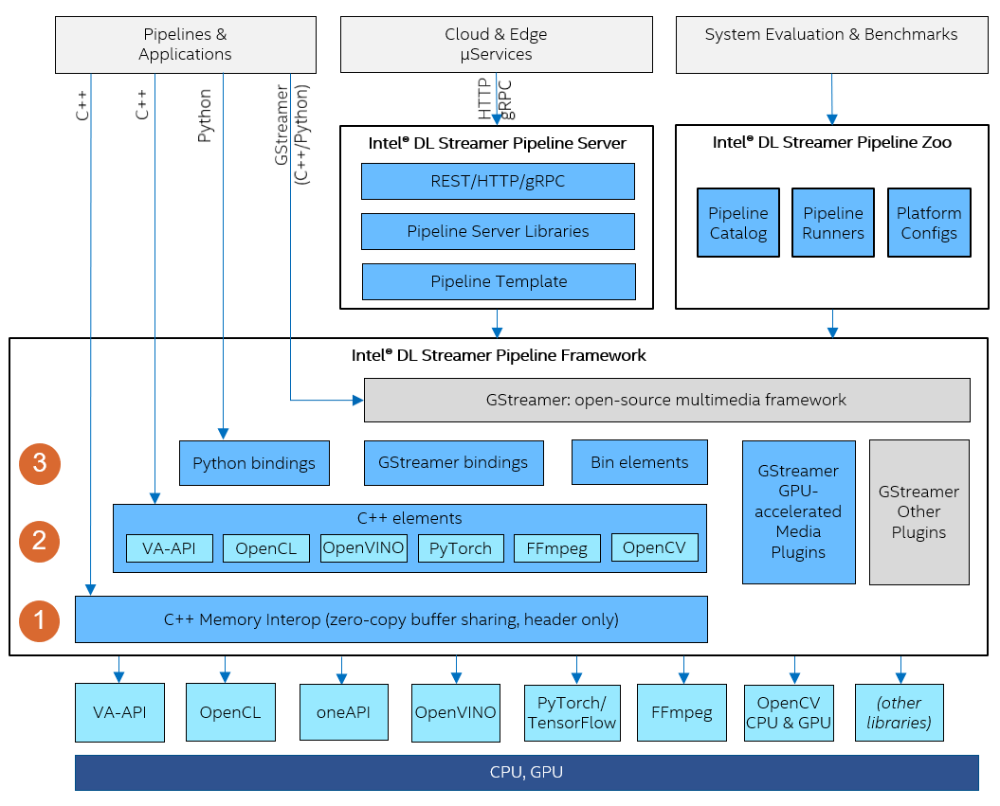

# Architecture 2.0

> **Note:** The Architecture 2.0 approach is being deprecated in favor of aligning
Deep Learning Streamer with [GStreamer analytics
library](https://gstreamer.freedesktop.org/documentation/analytics/index.html).

Deep Learning Streamer Pipeline Framework release 2022.2 introduces new
architecture 2.0, aiming for the following goals:

1. **Memory interop on CPU and GPU.** Provide independent sub-component
   (library) for zero-copy buffer sharing and memory mapping between
   various frameworks and memory handles on CPU and GPU. The zero-copy
   optimization technique is especially and critically important for
   devices connected with host via PCI, including dGPU. This
   sub-component also defines abstract C++ interfaces
   [Source](./api_ref/class_dlstreamer_Source),
   [Transform](./api_ref/class_dlstreamer_Transform) and
   [Sink](./api_ref/class_dlstreamer_Sink) for C++ elements implemented in next sub-component. See
   [Memory Interop and C++ abstract interfaces](./cpp_interfaces.md) for details.
2. **\"non-GStreamer\" backend support via C++/Python programming.**
   Expose Deep Learning Streamer functional blocks (elements) as both
   GStreamer elements and C++/Python interfaces accessible by any
   C++/Python application (not using GStreamer). These out-of-box
   elements support typical media analytics operations such as
   post-processing and visualization of inference results. C++/Python
   applications (including samples in Direct Programming section) can
   use mix of out-of-box elements, custom/additional elements, memory
   interop library and pipeline management logic on top to build
   complete performance-optimized media analytics pipeline. See
   [C++ elements](./cpp_elements.md) and [Elements list](./elements_list.md) and
   [Samples 2.0](./samples_2.0.md) for details.
3. **GStreamer bin elements.** Reimplement most gva\* elements as
   GStreamer bin elements which internally build sub-pipeline of other
   (low-level) GStreamer elements. Most low-level elements are C++
   elements (#2 above) automatically wrapped and registered as
   GStreamer elements. Each low-level element performs only single
   operation (no multi-stage processing inside element and no
   intermediate memory allocation) with all pipelining done on either
   bin-elements or application level. See pages
   [GStreamer Elements](./gstreamer_elements.md) and [GStreamer Bin Elements](./gstreamer_bins.md) for details.

The following diagram visualizes Architecture 2.0 sub-components ①, ②
and ③ inside block **Deep Learning Streamer Pipeline Framework**

> **Note:** Architecture 2.0 currently available in preview mode as transition not
> completed yet. There is no strict backward compatibility in preview mode
> (some changes/renaming may occur). It could be used for evaluation and
> prototyping, it's not recommended for production usage yet.

<!--hide_directive
:::{toctree}
:maxdepth: 1

migration_guide
cpp_interfaces
cpp_elements
gstreamer_elements
gstreamer_bins
python_bindings
pytorch_inference
elements_list
packaging
samples_2.0
api_ref/index
:::
hide_directive-->