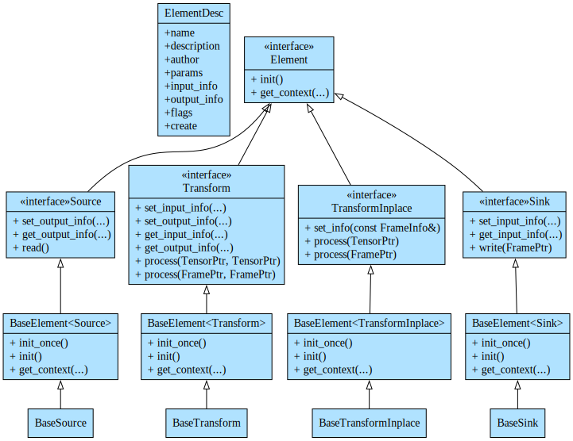

# ② C++ elements

Intel® DL Streamer C++ interface allows to develop new functional blocks
(source, transform and sink elements) with minimal effort. The interface
does not use any of GStreamer types, so elements/blocks written in this
interface can be used in both GStreamer-based and non-GStreamer
applications.

The C++ elements implementation typically inherit one of base classes
which partially implement some functions in corresponding abstract
interfaces:

- [BaseSource](./api_ref/class_dlstreamer_BaseSource) partially implements
  [Source](./api_ref/class_dlstreamer_Source)
- [BaseTransform](./api_ref/class_dlstreamer_BaseTransform) partially implements
  [Transform](./api_ref/class_dlstreamer_Transform)
- [BaseTransformInplace](./api_ref/class_dlstreamer_BaseTransformInplace) partially implements
  [Transform](./api_ref/class_dlstreamer_Transform)
- [BaseSink](./api_ref/class_dlstreamer_BaseSink) partially implements
  [Sink](./api_ref/class_dlstreamer_Sink) so that C++ element implements only remaining virtual functions (mostly `read`, `process` and `write` functions) as shown in diagram below

⠀
*C++ interfaces and base classes*



Many examples how to create C++ elements can be found on github
repository in [folder
src](https://github.com/open-edge-platform/edge-ai-libraries/tree/main/libraries/dl-streamer/src)
and sub-folders.

## Element description

The
[ElementDesc](api_ref/struct_dlstreamer_ElementDesc) structure is used to describe an element input/output
capabilities and supported parameters, and provide instance creation
function. The most important are the following fields:

- `name` - Name of element. Same name is used for both GStreamer and
  direct programming applications.
- `params` - Array of parameters supported by element. In case of
  GStreamer, those will be translated to GStreamer properties.
- `input_info` - Types of input [Frames]{.title-ref} that element
  can consume. In case of GStreamer interop, it will be represented as
  sink capabilities.
- `output_info` - Types of output [Frames]{.title-ref} that element
  can produce. In case of GStreamer interop, it will be represented as
  source (src) capabilities.
- `create` - Pointer to a function that creates an instance of an
  element.

Here's example of
[ElementDesc](api_ref/struct_dlstreamer_ElementDesc) structure for simple post-processing element:

```cpp
// Element parameters
ParamDescVector params_desc = {
  {"method", "Method used to post-process tensor data", "max", {"max", "softmax", "compound", "index"}},
  {"labels_file", "Path to .txt file containing object classes (one per line)", std::string()},
  {"layer_name", "Name of output layer to process (in case of multiple output tensors)", std::string()},
  {"threshold", "Threshold for confidence values", dflt::threshold, 0.0, 1.0},
};

// Element description
ElementDesc tensor_postproc_label = {
  .name = "tensor_postproc_label",
  .description = "Post-processing of classification inference to extract object classes",
  .author = "Intel Corporation",
  .params = &params_desc,
  .input_info = {MediaType::Tensors},
  .output_info = {MediaType::Tensors},
  .create = create_element<PostProcLabel>,
  .flags = 0};
```

## How to create instance of C++ element

Instance of C++ element can be created using functions `create_source`,
`create_transform`, `create_sink`. These functions take pointer to
`ElementDesc`, initialization parameters (as `std::map`) and optional
context pointer as
[parameters](./api_ref/namespace_dlstreamer)

```cpp
auto ffmpeg_source = create_source(ffmpeg_multi_source, {{"inputs", inputs}}, ffmpeg_ctx);
```

See direct programming samples
[ffmpeg_openvino](https://github.com/open-edge-platform/edge-ai-libraries/tree/main/libraries/dl-streamer/samples/ffmpeg_openvino)
and
[ffmpeg_dpcpp](https://github.com/open-edge-platform/edge-ai-libraries/tree/main/libraries/dl-streamer/samples/ffmpeg_dpcpp)
for examples.
