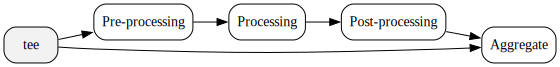
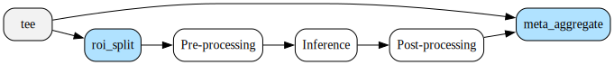
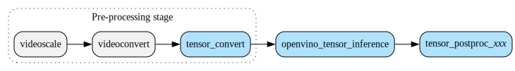
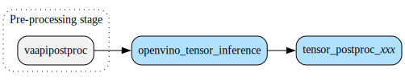
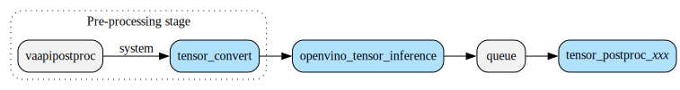

# ③ GStreamer Bin Elements

Deep Learning Streamer uses GStreamer bin elements to simplify creation of a
media analytics pipeline by providing most known scenarios in the form
of built single elements, such as inference, detection, classification,
tracking, etc. Internally such elements builds sub-pipeline using
*low-level elements*. The diagram below shows high-level sub-pipeline
inside Deep Learning Streamer bin elements.

*High-level bin elements architecture:*



The diagram shows two branches which are produced by `tee` element. The
*upper branch* is used for data-processing. The *bottom branch* is used
for preserving original frame.

## Pipelines with branches

Pipeline with branches is a bit tricky to write. So, an auxiliary
element was introduced - `processbin`. Is simplifies writing pipelines
shown on [High level bin elements architecture]{.title-ref} graph.

Here's an example of the same pipeline without and with `processbin`:

```sh
# Without processbin
filesrc location=$FILE ! decodebin3 ! \
tee name=t t. ! queue !  meta_aggregate name=mux ! fakesink \
t. ! videoscale ! videoconvert ! video/x-raw,format=BGRP ! tensor_convert ! \
  openvino_tensor_inference model=$MODEL device=CPU ! \
  queue ! tensor_postproc_detection threshold=0.5 ! mux.

# Using processbin
filesrc location=$FILE ! decodebin3 ! \
processbin \
  preprocess="videoscale ! videoconvert ! video/x-raw,format=BGRP ! tensor_convert" \
  process="openvino_tensor_inference model=$MODEL device=CPU" \
  postprocess="queue ! tensor_postproc_detection threshold=0.5" \
  aggregate="meta_aggregate" ! \
fakesink
```

In some way, `processbin` flattens the pipeline, so it's easier to
write, read, and modify. Internally, it builds sub-pipeline which is
shown on [High level bin elements architecture]{.title-ref} diagram.

## Pre-processing

Block `Pre-processing` on the `High level bin elements
architecture` diagram may contain one or multiple *low-level
elements* to convert `video/x-raw` or `audio/x-raw` buffers into data
format and layout required by `processing element`,
according to caps negotiation with `processing element`.

### Video Pre-processing

Typical video pre-processing operations include scaling, color
conversion, normalization.

#### Video Pre-processing Backends for Inference

Pre-processing operations inserted into pipeline between decode and
inference operations. By performance and data locality considerations,
pre-processing designed to support different backend libraries and can
run on CPU or GPU device depending on CPU or GPU device of inference and
decode. Deep Learning Streamer has following
pre-processing backends:

- `gst-opencv`
- `vaapi-opencl`
- `vaapi-tensors`
- `vaapi`
- `vaapi-surface-sharing`

Some of pre-processing backends follows schema *PRIMARY-SECONDARY*,
where *PRIMARY* is used for as many operations as possible, and
*SECONDARY* is used for all remaining operations if any:

- `gst`: GStreamer standard elements
- `opencv`: *low-level elements* based on OpenCV library
- `vaapi`: GStreamer standard and Deep Learning Streamer **low-level
  elements** based on media GPU-acceleration interface VA-API
- `opencl`: *low-level elements* based on OpenCL library

The following table summarizes default preprocessing backend depending
on decode or inference device. Note that preprocessing elements
communicate with decode element only by caps negotiation, and assume CPU
decode if caps negotiated to `memory:System` and GPU decode
if caps negotiated to `memory:VASurface`. You can override
default pre-processing backend by setting the `pre-process-backend` property in bin elements, however not all
combinations of decode and inference devices and pre-processing backends
are compatible, and overriding pre-processing backend may impact
performance.

| Decode device | Inference device | Default Pre-processing Backend |
| --- | --- | --- |
| CPU | CPU | gst-opencv |
| CPU | GPU | gst-opencv |
| GPU | CPU | vaapi |
| GPU | GPU | vaapi-surface-sharing |

#### Video Pre-processing Elements

Pre-processing performs differently in case of full-frame inference and
per-ROI *(Region Of Interest)* inference. You can control this using
property `inference-region` in bin elements. In can be set either to
`full-frame` or `roi-list`.

In case of full-frame inference, pre-processing is normal GStreamer
pipeline of scaling, color conversion, and normalization elements
executed on full frame.

In case of per-ROI inference, element `roi_split` inserted before
pre-processing elements. The `roi_split` iterates over all
`GstVideoRegionOfInterestMeta` attached to `GstBuffer`, and produces as
many `GstBuffer`'s as metadata found in original buffer. Every produced
`GstBuffer` has single `GstVideoCropMeta` with rectangle (x,y,w,h)
according to `GstVideoRegionOfInterestMeta` in original buffer.

If `object-class` property is set in bin element, this property passed
to `roi_split` element. As result `roi_split` may produce less buffers
than number of `GstVideoRegionOfInterestMeta` in original buffer,
skipping all `GstVideoRegionOfInterestMeta` with object class not
matching to specified in `object-class` property. Effectively, all
elements inserted after `roi_split` receive as many buffers per original
buffer as number objects on frame require inference operation.

The graph below high-level representation of per-ROI inference:

*Per-ROI inference:*



### Batched Pre-processing

The following elements support batched pre-processing for better
parallelization and performance:

1. `batch_create`
2. `vaapi_batch_proc`

If `batch_size` property specified in bin element (and passed to
inference element), one of these elements negotiate caps with inference
element on `other/tensors` media type having **'N'** dimension in
tensor shape greater than 1.

Element `vaapi_batch_proc` accumulate internally *N* frames, then submit
VA-API operation on *N* frames and output single buffer containing
pre-processing result of all *N* frames. Element `batch_create`
accumulates internally *N* frames (`GstBuffer`), then pushes them as
single `GstBufferList` containing all *N* frames.

Inference is performed in batched mode on buffer containing *N* frames.

Element `batch_split` inserted after inference element and before
post-processing element. This element splits batched frame with *N*
inference results into *N* frames, so that post-processing element can
work in normal mode.

#### Batched Pre-processing shared across multiple streams

If multiple (*M*\>1) streams run same or similar pipeline with inference
on same NN models, specifying property `shared-instance-id` with
identical string in all *M* streams may help to reduce latency in
batched mode. In this case *M* instances of element `vaapi_batch_proc*`
use single queue to accumulate *N* (=batch_size) frames from all *M*
streams, so that batched frame may contain data from different streams.

Information about original source of frames composed into batch (ex,
timestamp, stream id, ROI id, object id, etc.) attached to buffer as
`GstStructure`-based metadata `SourceIdentifierMeta` and passed
downstream. So that element `batch_split` can correctly split batched
inference result into *N* results and push each result into
corresponding (one of *M*) stream.

## Processing

Block `Processing` on the `High level bin elements
architecture` diagram usually represented as single element.

For inference this is an element that infer a result from trained neural
network using some inference engine as backend. An inference element
accepts input data and produces a inference result in form of
`other/tensors`.

Currently only one inference engine is supported - OpenVINO™. And the
element, which uses it as inference backend, is named
`openvino_tensor_inference`. More inference engines can be supported in
the future.

The inference elements sets proper/allowed tensors shape *(dims)* for
input and output caps once NN is read.

## Post-processing

The `Post-processing` box on the `High level bin
elements architecture` diagram usually consist of single element.

In case of inference a post-processing element is responsible for
decoding output tensor and converting it into metadata (ex.,
bounding-boxes, confidences, classes, keypoints, etc.). Because
different NN models may require different post-processing, there are
multiple post-processing elements. In general, every post-processing
element that work with tensors starts with `tensor_postproc_` prefix.

## Bin elements

Deep Learning Streamer provides variety of bin elements to simplify creation
of media analytics pipeline. Most of Deep Learning Streamer bin elements
internally use auxiliary element `processbin` to create a processing
sub-pipeline.

### "Video_inference" Element

This is generic inference element, it serves as base for `object_detect`
and `object_classify` bin elements. However, it can also be used as is.

It provides full backward compatibility in terms of element properties
with `gvainference` element.

Below are some of pipelines that the `video_inference` element builds
internally based on various parameters, such as input memory type,
pre-processing backend, inference device, inference region, etc. The
elements `tee` and `aggregate` are omitted for simplicity, but in
reality they are present in every pipeline.

*The "gst-opencv" pre-processing and full-frame inference on CPU or GPU:*



*The "vaapi" pre-processing and full-frame inference on CPU:*


*The "vaapi-opencl" pre-processing and full-frame inference on GPU:*


*The "vaapi-surface-sharing" pre-processing and full-frame inference on GPU:*



The `queue` element can be inserted after inference element to enable
parallel inference execution if number of inference requests (`nireq`)
is greater than one.

*The ``queue`` after inference*




### "Object_detect" Element

The `object_detect` element is based on `video_inference` and sets
post-processing element to `tensor_postproc_detection` by default. It
also disables attaching raw tensor data as metadata by default.

### "Object_classify" Element

The `object_classify` element is based on `video_inference` and sets
`inference-region` property to `roi-list` by default.
