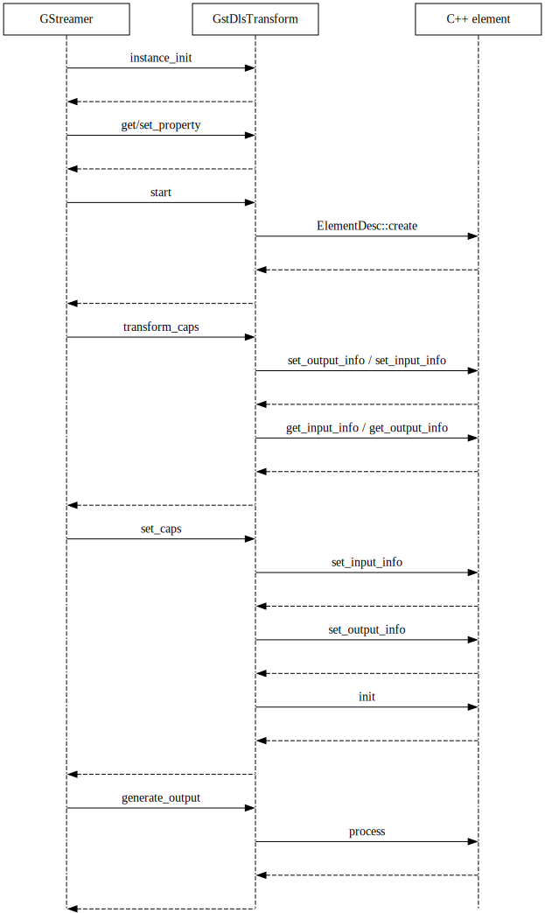

# ③ GStreamer Elements

The `GstDlsTransform` class serves as shim between C++ interface and
GStreamer and used to automatically register any C++ element as
GStreamer element. This shim is responsible for all interactions with
GStreamer, GLib type registrations, and wrapping Deep Learning Streamer C++
objects into GStreamer/GLib objects.

The following class diagram shows how `GstDlsTransform` connected to C++
interfaces and GStreamer interfaces. GStreamer independent blocks
colored in blue and GStreamer dependent blocks colored in gray.

*C++ interfaces and classes:*


## Register C++ element as GStreamer element

To register C++ element with GStreamer, `register_elements_gst_plugin`
function is used. It should be called from `plugin_init` function of
GStreamer plugin, here's an example:

``` cpp
static gboolean plugin_init(GstPlugin *plugin) {
  return register_elements_gst_plugin(tensor_postproc_label, plugin);
}
```

## How C++ element works as GStreamer element

In case of using C++ element in GStreamer pipeline, the shim
`GstDlsTransform` is responsible for element creation and operation. The
following sequence diagram shows how `GstDlsTransform` communicates with
GStreamer and an C++ element. It doesn't show all possible calls, but
only the main ones.

*High-level sequence diagram of element creation and operation:*


