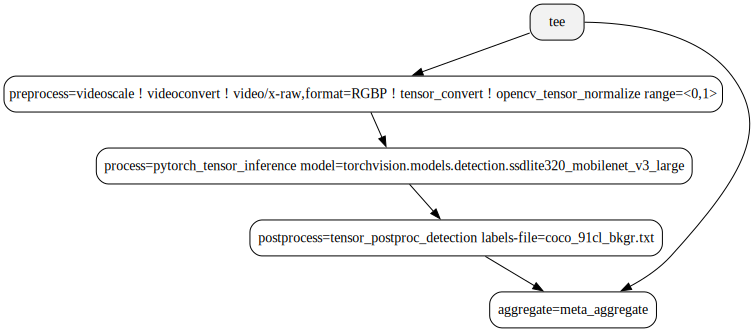

# PyTorch tensor inference

Deep Learning Streamer (DL Streamer) supports PyTorch inference backend via the
`pytorch_tensor_inference` GStreamer element implemented in Python.
Element description can be found in [Elements 2.0 reference](elements_list).

## Prior to the first run

Before using `pytorch_tensor_inference`, make sure that all of the
following requirements are met. Visit
[Install Guide](../get_started/install/install_guide_ubuntu.md) for more information about
installing DL Streamer.

1. `intel-dlstreamer-gst-python3-plugin-loader` and
   `intel-dlstreamer-gst-python3` packages are installed. If not, add a DL Streamer apt
   repository and install the following packages:

   ```bash
   apt-get update
   apt-get install -y python3-intel-dlstreamer
   ```

2. Python requirements are installed. If not, install using
   `reqirements.txt` file:

   ```bash
   python3 -m pip install --upgrade pip
   python3 -m pip install -r requirements.txt
   ```

3. DL Streamer environment has been configured. If not:

   ```bash
   source /opt/intel/dlstreamer/setupvars.sh
   ```

4. Verify the GStreamer python loader plugin via:

   ```bash
   gst-inspect-1.0 python
   ```

   There should be no errors in the output and the list of GStreamer
   elements should contain `pytorch_tensor_inference`.

## Loading model and weights

`pytorch_tensor_inference` supports several options for loading model
and weights.

- The easiest way to load model is to find the corresponding module in
  `torchvision` library and specify its name in the `model`
  property. You need to specify the full import path of the model, for
  example:
  `pytorch_tensor_inference model=torchvision.models.resnet50`. In
  this case, if weights are not specified, `pytorch_tensor_inference`
  takes the default weights from torchvision. In our example, these
  will be the `ResNet50_Weights.DEFAULT` weights.
- To use your custom weights for a model from `torchvision`, you need
  to specify the path to it using `model-weights` property:
  `pytorch_tensor_inference model=torchvision.models.resnet50 model-weights=/path/to/model-weights.pt`
- It is also possible to specify the path to the saved file with the
  model. In this case, this path must be specified using the same
  property `model`: `pytorch_tensor_inference model=/path/to/model.pt`

## Determining tensor shape

PyTorch doesn't provide static tensor shapes for input and output of a
model. To obtain the size of the output tensors during caps negotiations
phase, inference is performed on an random tensor, the size of which
will be set in accordance with the capabilities.

## DL Streamer pipelines with pytorch_tensor_inference

Below is an example using the `pytorch_tensor_inference` element in
pipeline to classify objects. This example uses the `resnet50` model
from torchvision with default weights and `processbin` element to split
stream data and merge it with inference results. Visit
`Elements 2.0 reference <elements_list>` for more information on the `processbin` element.

```sh
filesrc location=input_file.mp4 ! decodebin3 ! \
processbin \
  preprocess=videoscale ! videoconvert ! video/x-raw,format=RGBP ! tensor_convert ! opencv_tensor_normalize range=<0,1>, mean=<0.485, 0.456, 0.406>, std=<0.229, 0.224, 0.225> \
  process=pytorch_tensor_inference model=torchvision.models.resnet50 \
  postprocess=tensor_postproc_label method=softmax labels-file=/dlstreamer_dir/samples/labels/imagenet_2012.txt \
  aggregate=meta_aggregate ! \
meta_overlay ! \
autovideosink
```

## Integration into bin-elements

PyTorch tensor inference is included in inference bin elements such as
`video_inference`, `object_detect` and `object_classify`. These elements
construct sub-pipelines within themselves depending on the type of the
specified model. So if it's a file with PyTorch model or a module from
torchvision, the bin element will automatically use PyTorch inference
backend internally.

```sh
filesrc location=input_file.mp4 ! decodebin3 ! \
object_detect model=torchvision.models.detection.ssdlite320_mobilenet_v3_large labels-file=coco_91cl_bkgr.txt ! \
meta_overlay ! \
autovideosink
```

Below is a graph showing how the `object_detect` bin will be built.

*object_detect internal pipeline:*



By default, preprocessing will include color conversion to `RGB`,
resizing to `resize_size` if it can be obtained from the model's
preprocessing information, and rescaling to `[0.0, 1.0]`. If the model
requires additional operations during preprocessing, it can be described
using the model-proc file, which can then be specified in the bin
element. As described in the model-proc file, the bin element will build
the pre-processing pipeline. Visit
[How to Create Model-proc File](../dev_guide/model_preparation.md) for more information on creating a model-proc file.
