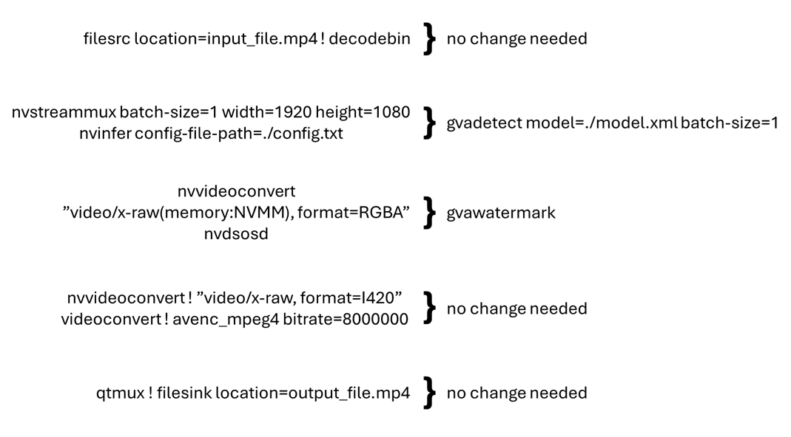

# Converting NVIDIA DeepStream Pipelines to Deep Learning Streamer Pipeline Framework

This article presents how to convert a pipeline from NVIDIA
DeepStream to Deep Learning Streamer Pipeline Framework. For this purpose,
a working example is described at each step, to help understand the applied modifications.

> **Note:** The intermediate steps of the pipeline are not meant to run. They are
> simply there as a reference example of the changes being made in each
> section.

## Contents

- [Preparing Your Model](#preparing-your-model)
- [Conversion Examples](#conversion-examples)
  - [Command Line Applications](#command-line-applications)
  - [Python Applications](#python-applications)
- [Conversion Rules](#conversion-rules-for-pipeline-elements)
  - [Mux and Demux Elements](#mux-and-demux-elements)
  - [Inferencing Elements](#inferencing-elements)
  - [Video Processing Elements](#video-processing-elements)
  - [Metadata Elements](#metadata-elements)
  - [Multiple Input Streams](#multiple-input-streams)
- [DeepStream to DLStreamer Mapping](#deepstream-to-dlstreamer-mapping)
  - [Element Mapping](#element-mapping-table)
  - [Property Mapping](#property-mapping-table)


## Preparing Your Model

> **Note:** To use Deep Learning Streamer Pipeline Framework and OpenVINO™ Toolkit the
> model needs to be in Intermediate Representation (IR) format. To convert
> your model to this format, follow the steps in [model preparation](./model_preparation.md).
>

## Conversion Examples

### Command Line Applications

The following sections show how to convert a DeepStream pipeline to
the DLStreamer. The DeepStream pipeline is taken from one of the
[examples](https://github.com/NVIDIA-AI-IOT/deepstream_reference_apps). It
reads a video stream from the input file, decodes it, runs inference,
overlays the inferences on the video, re-encodes and outputs a new .mp4
file.

```shell
filesrc location=input_file.mp4 ! decodebin ! \
nvstreammux batch-size=1 width=1920 height=1080 ! queue ! \
nvinfer config-file-path=./config.txt ! \
nvvideoconvert ! "video/x-raw(memory:NVMM), format=RGBA" ! \
nvdsosd ! queue ! \
nvvideoconvert ! "video/x-raw, format=I420" ! videoconvert ! avenc_mpeg4 bitrate=8000000 ! qtmux ! filesink location=output_file.mp4
```

The mapping below represents the typical changes that need to be made to
the pipeline to convert it to Deep Learning Streamer Pipeline Framework. The
pipeline is broken down into sections based on the elements used in the
pipeline.



### Python Applications

While GStreamer command line allows quick demonstration of a running pipeline, fine-grain control typically involves using a GStreamer pipeline object in a programmable way: either Python or C/C++ code. 

This section illustrates how to convert [DeepStream Python example](https://github.com/NVIDIA-AI-IOT/deepstream_python_apps/tree/master/apps/deepstream-test1) into [DLStreamer Python example](https://github.com/open-edge-platform/edge-ai-libraries/tree/main/libraries/dl-streamer/python/hello_dlstreamer). Both applications implement same functionality, yet they use DeepStream or DLStreamer elements as illustrated in a table below. The elements in __bold__ are vendor-specific, while others are regular GStreamer elements.

| DeepStream Element | DLStreamer Element | Function |
|---|---|---|
| filesrc | filesrc | Read video file |
| h264parse ! __nvv4l2decoder__ | decodebin3 | Decode video file |
| __nvstreammux__ ! __nvinfer__ | __gvadetect__ ! queue | Create batch buffer and run AI inference |
| __nvvideoconvert__ | videoconvertscale | Convert video format |
| __nvosd__ | __gvawatermark__ | Overlay analytics results |
| __nv3dsink__ | audiovideosink | Render results in a window |

Such pipelines can be created programmatically in a Python application using a sequence of API Calls:
```python
element = Gst.ElementFactory.make(...)
element.set_property(...)
pipeline.add(element)
element.link(next_element)
```

Please note DeepStream and DLStreamer applications use same set of regular GStreamer library functions to construct pipelines. 
The difference is in what elements are created and linked. In addition, DLStreamer `decodebin3` element uses late linking within a callback function.

<table>
<thead>
<tr>
<th>DeepStream Pipeline Creation in Python</th>
<th>DLStreamer Pipeline Creation in Python</th>
</tr>
</thead>
<tbody>
<tr>
<td><pre><code>
pipeline = Gst.Pipeline()
...
source = Gst.ElementFactory.make("filesrc", "file-source")
h264parser = Gst.ElementFactory.make("h264parse", "h264-parser")
...
source.set_property('location', args[1])
streammux.set_property('batch-size', 1)
...
pipeline.add(source)
pipeline.add(h264parser)
...
source.link(h264parser)
h264parser.link(decoder)
</code></pre></td>
<td><pre><code>
pipeline = Gst.Pipeline()
...
source = Gst.ElementFactory.make("filesrc", "file-source")
decoder = Gst.ElementFactory.make("decodebin3", "media-decoder")
...
source.set_property('location', args[1])
detect.set_property('batch-size', 1)
...
pipeline.add(source)
pipeline.add(decoder)
...
source.link(decoder)
decoder.connect("pad-added",
  lambda element, pad, data: element.link(data) if pad.get_name().find("video") != -1 and not pad.is_linked() else None, 
  detect)
</code></pre></td>
</tr>
</tbody>
</table>

Once pipelines are created, both applications register a custom probe handler and attach it to the sink pad of the overlay element.
The probe registration code is (again) very similar, except different elements being used: `nvosd` and `gvawatermark`

<table>
<thead>
<tr>
<th>DeepStream Probe Registration</th>
<th>DLStreamer Probe Registration</th>
</tr>
</thead>
<tbody>
<tr>
<td><code>
osdsinkpad = nvosd.get_static_pad("sink")
osdsinkpad.add_probe(Gst.PadProbeType.BUFFER, osd_sink_pad_buffer_probe, 0)
</code></td>
<td><code>
watermarksinkpad = watermark.get_static_pad("sink")
watermarksinkpad.add_probe(Gst.PadProbeType.BUFFER, watermark_sink_pad_buffer_probe, 0)
</code></td>
</tr>
</tbody>
</table>

The probe function iterates over prediction metadata found by the AI model. Here, DeepStream and DLStreamer implementation differ significantly. DeepStream sample uses DeepStream-specific structures for batches of frames, frames and objects within a frame. On the contrary, DLStreamer sample uses regular GStreamer data structures from [GstAnalytics metadata library](https://gstreamer.freedesktop.org/documentation/analytics/index.html?gi-language=python#analytics-metadata-library). Please also note DLStreamer handler runs on per-frame frequency while DeepStream sample runs on per-batch (of frames) frequency. 

<table>
<thead>
<tr>
<th>DeepStream Probe Implementation</th>
<th>DLStreamer Probe Implementation</th>
</tr>
</thead>
<tbody>
<tr>
<td><pre><code>
batch_meta = pyds.gst_buffer_get_nvds_batch_meta(hash(gst_buffer))
...
l_frame = batch_meta.frame_meta_list
...
while l_frame is not None:
  frame_meta = pyds.NvDsFrameMeta.cast(l_frame.data)
  ...
  l_obj=frame_meta.obj_meta_list
    while l_obj is not None:
      ... process object metadata
</code></pre></td>
<td><pre><code>
# no batch meta in DLStreamer, probes run per-frame
...
frame_meta = GstAnalytics.buffer_get_analytics_relation_meta(buffer)
for obj in frame_meta:
  ... process object metadata
</code></pre></td>
</tr>
</tbody>
</table>

The last table compares pipeline execution logic. Both applications set the pipeline state to `PLAYING` and run the main GStreamer event loop.
DeepStream sample invokes a predefined event loop from a DeepStream library, while DLStreamer application explicitly adds the message processing loop. 
Both implementations keep running the pipeline until end-of-stream message is received.

<table>
<thead>
<tr>
<th>DeepStream Pipeline Execution</th>
<th>DLStreamer Pipeline Execution</th>
</tr>
</thead>
<tbody>
<tr>
<td><pre><code>
# create an event loop and feed gstreamer bus messages to it
loop = GLib.MainLoop()
bus = pipeline.get_bus()
bus.add_signal_watch()
bus.connect ("message", bus_call, loop)
&nbsp
# start play back and listen to events
pipeline.set_state(Gst.State.PLAYING)
  try:
    loop.run()
  except:
    pass
&nbsp
pipeline.set_state(Gst.State.NULL)
</code></pre></td>
<td><pre><code>
bus = pipeline.get_bus()
&nbsp
# run explicit pipeline loop, handle ERROR and EOS messages
pipeline.set_state(Gst.State.PLAYING)
terminate = False
while not terminate:
  msg = bus.timed_pop_filtered(Gst.CLOCK_TIME_NONE, Gst.MessageType.EOS | Gst.MessageType.ERROR)
  if msg:
    if msg.type == Gst.MessageType.ERROR:
      ... handle errors
      terminate = True                
    if msg.type == Gst.MessageType.EOS:
      terminate = True
pipeline.set_state(Gst.State.NULL)
</code></pre></td>
</tr>
</tbody>
</table>

## Conversion Rules for Pipeline Elements

### Mux and Demux Elements

The following sections provide more details on how to replace each element.

- Remove `nvstreammux` and `nvstreamdemux` and all their properties.
  - These elements combine multiple input streams into a single
    batched video stream (DeepStream-specific). Deep Learning Streamer takes
    a different approach: it employs a generic GStreamer syntax to
    define parallel streams. The cross-stream batching happens at
    the inferencing elements by setting the same `model-instance-id`
    property.
  - In this example, there is only one video stream, so it can be skipped
    for now. See the [Multiple Input Streams](#multiple-input-streams) section
    below for more information on how to construct multi-stream
    pipelines.

At this stage, you have removed `nvstreammux` and the `queue` that
followed it. Keep in mind, that the `batch-size` property is also removed. It will
be added in the next section as a property of the Pipeline Framework
inference elements.

```shell
filesrc location=input_file.mp4 ! decodebin3 ! \
nvinfer config-file-path=./config.txt ! \
nvvideoconvert ! "video/x-raw(memory:NVMM), format=RGBA" ! \
nvdsosd ! queue ! \
nvvideoconvert ! "video/x-raw, format=I420" ! videoconvert ! avenc_mpeg4 bitrate=8000000 ! qtmux ! filesink location=output_file.mp4
```

### Inferencing Elements

- Remove `nvinfer` and replace it with `gvainference`, `gvadetect` or
  `gvaclassify` depending on the following use cases:

  - For detection of objects on full frames and outputting a region of
    interest, use [gvadetect](../elements/gvadetect.md).
    This replaces `nvinfer` when it is used in primary
    mode.

    - Replace the `config-file-path` property with `model` and
      `model-proc`.
    - `gvadetect` generates `GstVideoRegionOfInterestMeta`.

  - For classification of previously detected objects, use
    [gvaclassify](../elements/gvaclassify.md).
    This replaces `nvinfer` when it is used in secondary
    mode.

    - Replace the `config-file-path` property with `model` and
      `model-proc`.
    - `gvaclassify` requires `GstVideoRegionOfInterestMeta` as
      input.

  - For generic full frame inference, use
    [gvainference](../elements/gvainference.md).
    This replaces `nvinfer` when used in primary mode.

    - `gvainference` generates `GstGVATensorMeta`.

In this example, you will use `gvadetect` to infer on the full frame and
output the region of interests. `batch-size` is also added for consistency
with what was removed above (the default value is `1` so it is not
needed). The `config-file-path` property is replaced with `model` and
`model-proc` properties as described in
[Configuring Model for Deep Learning Streamer](#configuring-model-for-deep-learning-streamer)
above.

```shell
filesrc location=input_file.mp4 ! decodebin3 ! \
gvadetect model=./model.xml model-proc=./model_proc.json batch-size=1 ! queue ! \
nvvideoconvert ! "video/x-raw(memory:NVMM), format=RGBA" ! \
nvdsosd ! queue ! \
nvvideoconvert ! "video/x-raw, format=I420" ! videoconvert ! avenc_mpeg4 bitrate=8000000 ! qtmux ! filesink location=output_file.mp4
```

### Video Processing Elements

- Replace NVIDIA-specific video processing elements with native
  GStreamer elements.

  - `nvvideoconvert` with `vapostproc` (GPU) or `videoconvert`
    (CPU).

    If the `nvvideoconvert` is being used to convert to/from
    `memory:NVMM` it can be removed.

  - `nvv4ldecoder` can be replaced with `va{CODEC}dec`, for example
    `vah264dec` for decoding only. Alternatively, the native `decodebin3`
    GStreamer element can be used to automatically choose an
    available decoder.

- Some caps filters that follow an inferencing element may need to be
  adjusted or removed. Pipeline Framework inferencing elements do not
  support color space conversion in post-processing. You will need to
  have a `vapostproc` or `videoconvert` element to handle this.

In example below, you remove a few caps filters and instances of `nvvideoconvert`
used for conversions from DeepStream's NVMM because Pipeline Framework
uses standard GStreamer structures and memory types. You use the
standard `videoconvert` GStreamer element to do color space conversion
on CPU. However, if available, it is recommended to use `vapostproc` to run on
Intel Graphics. Also, you use the standard `decodebin` GStreamer element
to choose an appropriate demuxer and decoder depending on
the input stream as well as what is available on the system.

```shell
filesrc location=input_file.mp4 ! decodebin3 ! \
gvadetect model=./model.xml model-proc=./model_proc.json batch-size=1 ! queue ! \
nvdsosd ! queue ! \
videoconvert ! avenc_mpeg4 bitrate=8000000 ! qtmux ! filesink location=output_file.mp4
```

### Metadata Elements

- Replace `nvtracker` with [gvatrack](../elements/gvatrack.md).

  - Remove the `ll-lib-file` property. Optionally, replace it with
    `tracking-type` if you want to specify the used algorithm. By
    default, it will use the 'short-term' tracker.

  - Remove all other properties.

- Replace `nvdsosd` with [gvawatermark](../elements/gvawatermark.md).

  - Remove all properties.

- Replace `nvmsgconv` with [gvametaconvert](../elements/gvametaconvert.md).

  - `gvametaconvert` can be used to convert metadata from
    inferencing elements to JSON and to output metadata to the
    GST_DEBUG log.
  - It has optional properties to configure what information goes
    into the JSON object including frame data for frames with no
    detections found, tensor data, the source of the inferences,
    and tags, a user defined JSON object that is attached to
    each output for additional custom data.

- Replace `nvmsgbroker` with [gvametapublish](../elements/gvametapublish.md).

  - `gvametapublish` can be used to output the JSON messages,
    generated by `gvametaconvert` to stdout, a file, MQTT or Kafka.

The only metadata processing done in this pipeline serves to overlay
the inferences on the video for which you use `gvawatermark`.

```shell
filesrc location=input_file.mp4 ! decodebin3 ! \
gvadetect model=./model.xml model-proc=./model_proc.json batch-size=1 ! queue ! \
gvawatermark ! queue ! \
videoconvert ! avenc_mpeg4 bitrate=8000000 ! qtmux ! filesink location=output_file.mp4
```

### Multiple Input Streams

Unlike DeepStream, where all sources need to be linked to the sink
pads of the `nvstreammux` element, Pipeline Framework uses existing
GStreamer mechanisms to define multiple parallel video processing
streams. This approach allows reusing native GStreamer elements within
the pipeline. The input streams can share the same Inference Engine if they
have the same `model-instance-id` property. This enables creating inference
batching across streams.

For DeepStream, the simple pipeline involving two streams is presented in the
code snippet below.

- The first line defines a common inference element for two (muxed and batched) streams.
- The second line defines per-stream input operations prior to muxing.
- The third line defines per-stream output operations after de-muxing.

```bash
nvstreammux ! nvinfer batch-size=2 config-file-path=./config.txt ! nvstreamdemux \
filesrc ! decode ! mux.sink_0 filesrc ! decode ! mux.sink_1 \
demux.src_0 ! encode ! filesink demux.src_1 ! encode ! filesink
```

The native GStreamer syntax below uses Pipeline Framework to define
operations for two parallel streams. When you set `model-instance-id` to the same value,
both streams will share the same instance of the `gvadetect` element. That means you can
define the shared inference parameters (the model, the batch size, \...) only in the first
line:

```shell
filesrc ! decode ! gvadetect model-instance-id=model1 model=./model.xml batch-size=2 ! encode ! filesink \
filesrc ! decode ! gvadetect model-instance-id=model1 ! encode ! filesink
```

## DeepStream to DLStreamer Mapping

### Element Mapping

The table below provides quick reference for mapping typical DeepStream
elements to Deep Learning Streamer elements or GStreamer.

| DeepStream Element | DLStreamer Element |
|---|---|
| [nvinfer](https://docs.nvidia.com/metropolis/deepstream/dev-guide/text/DS_plugin_gst-nvinfer.html) | [gvadetect](../elements/gvadetect), [gvaclassify](../elements/gvaclassify.md), [gvainference](../elements/gvainference.md) |
| [nvdsosd](https://docs.nvidia.com/metropolis/deepstream/dev-guide/text/DS_plugin_gst-nvdsosd.html) | [gvawatermark](../elements/gvawatermark.md) |
| [nvtracker](https://docs.nvidia.com/metropolis/deepstream/dev-guide/text/DS_plugin_gst-nvtracker.html) | [gvatrack](../elements/gvatrack.md) |
| [nvmsgconv](https://docs.nvidia.com/metropolis/deepstream/dev-guide/text/DS_plugin_gst-nvmsgconv.html) | [gvametaconvert](../elements/gvametaconvert.md) |
| [nvmsgbroker](https://docs.nvidia.com/metropolis/deepstream/dev-guide/text/DS_plugin_gst-nvmsgbroker.html) | [gvametapublish](../elements/gvametapublish.md) |

| DeepStream Element | GStreamer Element |
|---|---|
| nvvideoconvert | videoconvert |
| nvv4l2decoder | decodebin3 |
| nvv4l2h264dec | vah264dec |
| nvv4l2h265dec | vah265dec |
| nvv4l2h264enc | vah264enc |
| nvv4l2h265enc | vah265enc |
| nvv4l2vp8dec | vavp8dec |
| nvv4l2vp9dec | vavp9dec |
| nvv4l2vp8enc | vavp8enc |
| nvv4l2vp9enc | vavp9enc |

## Property Mapping

NVIDIA DeepStream uses a combination of model configuration files and
DeepStream element properties to specify inference actions, as well as
pre- and post-processing steps before/after running inference, as
documented here:
[here](https://docs.nvidia.com/metropolis/deepstream/dev-guide/text/DS_plugin_gst-nvinfer.html).

Similarly, Deep Learning Streamer Pipeline Framework uses GStreamer element
properties for inference settings and
[model proc](./model_proc_file.md) files for pre- and post-processing steps.

The following table shows how to map commonly used NVIDIA DeepStream
configuration properties to Deep Learning Streamer settings.

| NVIDIA DeepStream config file | NVIDIA DeepStream element property | Deep Learning Streamer model proc file | Deep Learning Streamer element property | Description |
|---|---|---|---|---|
| model-engine-file <path> | model-engine-file <path> | &nbsp; | model <path> | The path to an inference model network file. |
| labelfile-path <path> | &nbsp; | &nbsp; | labels-file <path> | The path to .txt file containing object classes. |
| network-type <0..3> | &nbsp; | &nbsp; | <br>gvadetect for detection, instance segmentation<br>gvaclassify for classification, semantic segmentation<br><br> | Type of inference operation. |
| batch-size <N> | batch-size <N> | &nbsp; | batch-size <N> | The number of frames batched together for a single inference. |
| maintain-aspect-ratio | &nbsp; | resize: aspect-ratio | &nbsp; | The number of frames batched together for a single inference. |
| num-detected-classes | &nbsp; | &nbsp; | &nbsp; | The number of classes detected by the model, inferred from a label file by Deep Learning Streamer. |
| interval <N> | interval <N> | &nbsp; | inference-interval <N+1> | An inference action executed every Nth frame. Note that Deep Learning Streamer value is greater by 1. |
| &nbsp; | threshold | &nbsp; | threshold | The threshold for detection results. |


