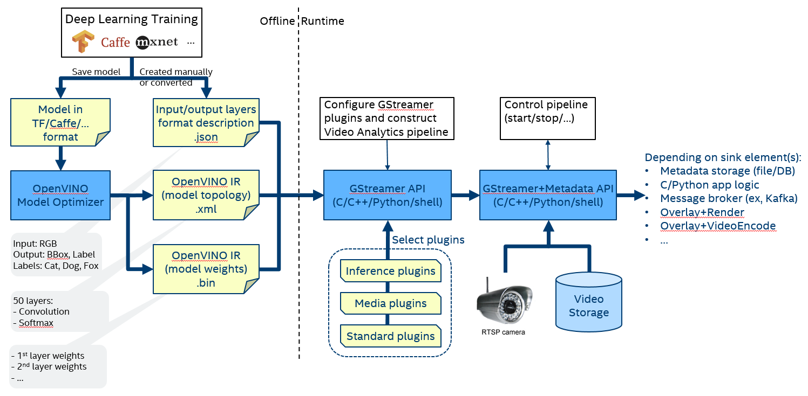

Model Preparation
=================

1. Model files format used by OpenVINO™ Toolkit
-----------------------------------------------

Video Analytics GStreamer plugins utilize
`Intel® Distribution of OpenVINO™ Toolkit <https://software.intel.com/en-us/openvino-toolkit>`__
as a back-end for high efficiency-inference on Intel® CPU and accelerators
(GPU, VPU, FPGA) and require CNN model to be converted from training
framework format (e.g., TensorFlow or Caffe) into a format optimized for
inference on the target device. The model format used by OpenVINO™ Toolkit
consists of two files - .xml: A small file with a description of the network
topology in XML language - .bin: Binary file (potentially big) with
model weights Also such format can be called Intermediate
Representation (IR) format.

You can either:

#. Choose model(s) from the extensive set of pre-trained models available in
   `Open Model Zoo <https://github.com/openvinotoolkit/open_model_zoo>`__ (already in IR format)

#. Use `Model Optimizer from OpenVINO™ Toolkit <https://software.intel.com/en-us/articles/OpenVINO-ModelOptimizer>`__ 
   tool for converting your model from training framework format (e.g., TensorFlow) into IR format

When using a pre-trained model from Open Model Zoo, consider using the
`Model Downloader <https://docs.openvino.ai/latest/omz_tools_downloader.html>`__
 tool to facilitate the model downloading process.

In the case of converting a custom model, you can optionally utilize the 
`Post-Training Optimization Toolkit <https://docs.openvino.ai/latest/pot_README.html>`__
for converting the model into a performance efficient, and more
hardware-friendly representation, for example quantize from 32-bit
floating point-precision into 8-bit integer precision. This gives a
significant performance boost (up to 4x) on some hardware platforms
including the CPU, with only a minor accuracy drop.

If you prefer graphical UI over command-line tools, consider the web-based
`Deep Learning Workbench <https://docs.openvino.ai/latest/workbench_docs_Workbench_DG_Introduction.html>`__
tool which provides all the functionality mentioned below and more in a
web-browser graphical interface

* download pre-trained model 
* convert a model from training framework format
* quantize into INT8 precision with accuracy checking 
* profile per-layer performance
* tune hyper parameters for throughput vs latency tradeoff

2. Model pre- and post-processing specification file
----------------------------------------------------

Intel® Deep Learning Streamer (Intel® DL Streamer) Pipeline Framework plugins are capable of
optionally performing certain pre- and post-processing operations before/after inference.

Pre- and post-processing are configured with the “model-proc”
file. Its format and all possible pre- and post-processing configuration
parameters are described on the `model-proc description <model_proc_file>`__
page.

**Pre-processing** is an input data transformation into an appropriate form
which a neural network expects it to be. Since Pipeline Framework mostly
supports Convolutional Neural Networks, most pre-processing actions are
performed under images. Pipeline Framework provides several pre-processing
back-ends depending on your use case.

**To use one of them, set the pre-process-backend property of the inference
element to one from the table below.**

**Default behavior**: If the property is not set, Pipeline Framework will pick
``ie`` if system memory is used in pipeline, ``vaapi`` - for GPU memory
(VASurface and DMABuf).

.. list-table::
   :widths: 25, 50, 25, 25
   :header-rows: 1

   * - pre-process-backend
     - Description
     - Memory type in pipeline
     - Configurable with model-proc?
   * - ie
     - Short for "Inference Engine". It resizes an image with a bilinear algorithm and sets color format which is deduced from current media. All that's done with capabilities provided by Inference Engine from OpenVINO™ Toolkit.
     - System
     - No
   * - opencv
     - All power of OpenCV is leveraged for input image pre-processing. Provides a wide variety of operations that can be performed on image.
     - System
     - Yes
   * - vaapi
     - Should be used in pipelines with GPU memory. Performs mapping to the system memory and uses opencv pre-processor.
     - | VASurface
       | *and*
       | DMABuf
     - Yes
   * - vaapi-surface-sharing
     - Should be used in pipelines with GPU memory and GPU inference device. Doesn't perform mapping to the system memory. As a pre-processor, it performs bilinear image resize, crop, and sets color format to NV12.
     - | VASurface
       | *and*
       | DMABuf
     - Partially

**Post-processing** is a raw inference results processing using so
called converters. Converters just transform the results from raw output
``InferenceEngine::Blob`` to required representation. Once output blob
is processed and the data is transformed, it is attached to a frame as
meta data.

If there's no suitable pre- and/or post-processing implementation in DL
Streamer, `Custom Processing <custom_processing>`__ can be used.

3. Specify model files in GStreamer elements
--------------------------------------------

The .xml model file path specified in mandatory property 'model' of
GStreamer inference elements gvainference/gvadetect/gvaclassify. For
example pipeline with object detection (gvadetect) and classification
(gvaclassify)

.. code:: sh

   gvadetect model=MODEL1_FILE_PATH.xml ! gvaclassify model=MODEL1_FILE_PATH.xml

The .bin file expected to be located under same folder as .xml file,
same filename but different extension .bin.

Pipeline example including gvadetect and gvaclassify with
pre-processing/post-processing rules may look like

.. code:: sh

   gvadetect model=MODEL1_FILE_PATH.xml model-proc=MODEL1_FILE_PATH.json ! gvaclassify model=MODEL2_FILE_PATH.xml model-proc=MODEL2_FILE_PATH.json

4. Workflow diagram
-------------------

The following diagram illustrates overall workflow

.. toctree::
   :maxdepth: 2

   yolov5_model_preparation
