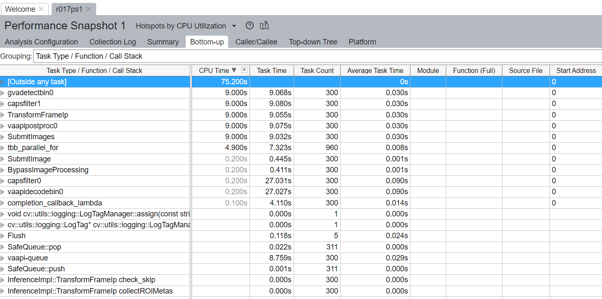
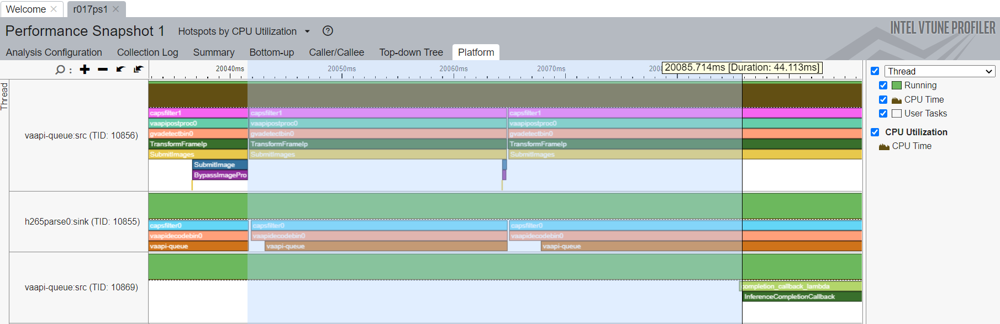

# Profiling with Intel VTune™

This page describes how to enable ITT tracing and analyze performance of
Deep Learning Streamer and GStreamer
elements using Intel VTune™ tool.

> **NOTE:**  Intel VTune™ uses ITT interface to capture custom tasks and visualize
> them on the Profile tab. ITT instrumentation is enabled in the default builds of
> Deep Learning Streamer, oneTBB, OpenCL intercept-layer, and some other
> libraries, but disabled by default in binary releases of OpenVINO™
> toolkit. Refer to the
> [wiki page](https://github.com/openvinotoolkit/openvino/wiki/BuildingCode) for
> instructions how to build OpenVINO™ toolkit from sources and
> additionally pass `-DENABLE_PROFILING_ITT=ON` option to cmake during
> the configuration. More details about ITT instrumentation in OpenVINO™
> toolkit can be found in the
> [documentation](https://github.com/openvinotoolkit/openvino/blob/master/src/docs/performance_analysis_ITT_counters.md).

## 1. Install VTune™

The recommended method of using VTune™ is Windows-to-Linux remote
profiling/analysis.

First,
[download and install VTune™](https://www.intel.com/content/www/us/en/developer/tools/oneapi/vtune-profiler-download.html).

Choose the Online Installer option.

## 2. Configure VTune™ host platform, Windows-to-Linux remote profiling method

1. Open VTune™ and create a new project (or just Configure Analysis).

2. Setup configuration in three panes **WHERE**, **WHAT**, **HOW**.

3. For configuration in the **WHERE** pane, see:
    <https://www.intel.com/content/www/us/en/develop/documentation/vtune-help/top/set-up-analysis-target/linux-targets/remote-linux-target-setup/configuring-ssh-access-for-remote-collection.html>

4. For configuration in the **WHAT** pane, create a script file on the
   **target-Linux** system, as shown below.

   Modify the **command** parameter in the script.

   ```bash
   #!/bin/bash
   command="$@"
   #e.g. command="gst-launch-1.0 filesrc location=<VIDEO_FILE> ! decodebin3 ! gvainference model=<MODEL>.xml ! fakesink sync=false"

   # OpenVINO™ Toolkit environment
   source /opt/intel/openvino_2024/setupvars.sh

   # Deep Learning Streamer environment
   source /opt/intel/dlstreamer/gstreamer/setupvars.sh
   source /opt/intel/dlstreamer/setupvars.sh

   # Run VTune™ collector
   $command
   ```

   Set the **Application** path pointing to the script above.

   Update the advanced options: ensure the `Analyze child processes` check-box
   is set.

5. For configuration in the **HOW** pane, select "Hotspots" or other
   Accelerators analysis.

   <https://www.intel.com/content/www/us/en/docs/vtune-profiler/user-guide/2024-0/getting-started.html>

6. Press the "Start" button to execute your pipeline and collect performance
   snapshot.

## 3. Results Analysis

When the results are ready, you can check the **Bottom-UP** tab (Grouping "Task Type
Function Call stack") to check how much time each task took and
how many times it was called.

For example, the screenshot below shows that whole pipeline duration was
75.2s (including models load step). Inference (`gvadetect`) in general
took 9.068s of whole pipeline execution and was called 300 times
(Because input media file had 300 frames.). 4.110s of this inference
was taken by Inference completion callback (`completion_callback_lambda`)
where DL Streamer processes inference results from OV. And about 0.445s
for Submitting image. This means that the remaining time 9.068 - 4.110 -
0.445 = 4.513s was taken by executing inference inside OV.



Also, you can check the "platform" tab to see a detailed calls graph and measure
call time of each method.

The screenshot below shows how to measure first OpenVINO™
Toolkit inference time: the time from the first "Submit images" till first
completion callback call.


