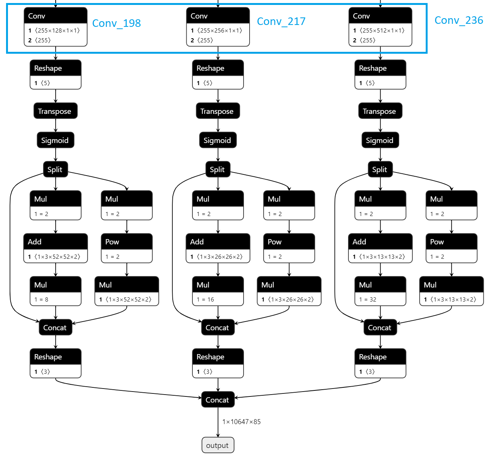

Yolov5 Model Preparation Example
================================

This page demonstrates preparation of a custom model, specifically **yolov5s** from `ultralytics/yolov5 GitHub repository <https://github.com/ultralytics/yolov5>`__.
The conversion follows Pytorch -> ONNX -> OpenVINO™ IR format.

1. Setup
-----------

Clone YOLOv5 repository

.. code:: sh

   git clone https://github.com/ultralytics/yolov5

Set up the environment

.. code:: sh

   pip install -r requirements.txt
   pip install onnx

Download Pytorch weights

.. code:: sh

   wget https://github.com/ultralytics/yolov5/releases/download/v3.0/yolov5s.pt

2. Pytorch to ONNX Conversion
-----------------------------

..

    Note: An image size of 416 is selected in this example, one could set other sizes

.. code:: sh

   python3 export.py  --weights yolov5s.pt  --imgsz 416 --batch 1 --include onnx

The output should resemble

.. code:: sh

   export: data=data/coco128.yaml, weights=['yolov5s.pt'], imgsz=[416], batch_size=1, device=cpu, half=False, inplace=False, train=False, optimize=False, int8=False, dynamic=False, simplify=False, opset=12, verbose=False, workspace=4, nms=False, agnostic_nms=False, topk_per_class=100, topk_all=100, iou_thres=0.45, conf_thres=0.25, include=['onnx']
   YOLOv5 🚀 v6.1-207-g5774a15 Python-3.8.10 torch-1.11.0+cu102 CPU

   Fusing layers...
   YOLOv5s summary: 232 layers, 7459581 parameters, 0 gradients

   PyTorch: starting from yolov5s.pt.1 with output shape (1, 10647, 85) (14.5 MB)

   ONNX: starting export with onnx 1.11.0...
   ONNX: export success, saved as yolov5s.pt.onnx (28.7 MB)

   Export complete (1.57s)
   Results saved to /home/vidyasiv/yolov5
   Detect:          python detect.py --weights yolov5s.pt.onnx
   PyTorch Hub:     model = torch.hub.load('ultralytics/yolov5', 'custom', 'yolov5s.pt.onnx')
   Validate:        python val.py --weights yolov5s.pt.onnx
   Visualize:       https://netron.app

3. ONNX to IR Conversion
-------------------------

During conversion to IR format with the model optimizer, specify ``--output`` with the names of the final output convolution layers in the ONNX file as shown below.

.. code:: sh

   mo  --input_model yolov5s.onnx --model_name yolov5s --scale 255 --reverse_input_channels --output Conv_198,Conv_217,Conv_236 --data_type FP16 --output_dir yolov5/FP16
   mo  --input_model yolov5s.onnx --model_name yolov5s --scale 255 --reverse_input_channels --output Conv_198,Conv_217,Conv_236 --data_type FP32 --output_dir yolov5/FP32

..

    Note: Output layer names will vary for yolov5l, yolov5m etc

For more details on Model Optimizer, see `Model Optimizer from OpenVINO™ Toolkit <https://software.intel.com/en-us/articles/OpenVINO-ModelOptimizer>`__
As explained in `Model Files Format section <model_preparation_essentials>`__,  the model layout will be as shown below:

.. code:: sh

    yolov5
    ├── FP16
    │   ├── yolov5s.bin
    │   ├── yolov5s.mapping
    │   └── yolov5s.xml
    └── FP32
        ├── yolov5s.bin
        ├── yolov5s.mapping
        └── yolov5s.xml

4. Model Pre/Post Processing
----------------------------

This model did not require any custom pre/post-processing. For post-processing, a converter named ``yolo_v5`` has been implemented that handles the transformation of the results from raw output
``InferenceEngine::Blob`` to required representation that contains confidence and bounding box center coordinates and dimensions.
A model-proc file has been included for yolov5 at `yolo-v5.json <https://github.com/dlstreamer/dlstreamer/blob/master/samples/gstreamer/model_proc/public/yolo-v5.json>`__

5. Running a GStreamer pipeline
--------------------------------
As covered in `Model Files Format section <model_preparation_essentials>`__, you will have to set ``model``, ``model-proc`` properties for the gvadetect element

.. code:: sh

   gvadetect model=MODEL1_FILE_PATH.xml model-proc=MODEL1_FILE_PATH.json !

For batch sizes > 1, there is no additional preparation needed, one can run by setting ``batch_size``

.. code:: sh

   gvadetect model=MODEL1_FILE_PATH.xml model-proc=MODEL1_FILE_PATH.json batch-size=2!

References
===========
1. https://github.com/violet17/yolov5_demo
