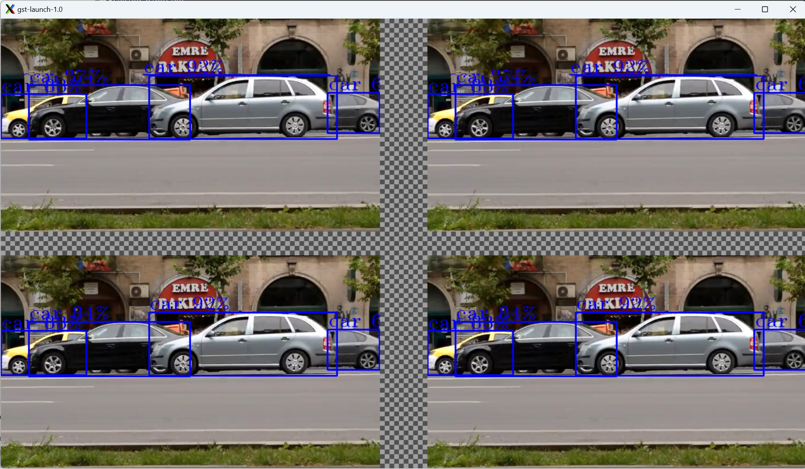

# Compositor

## Using the GStreamer framework *Compositor* element for merging many video displays into a single view

The GStreamer framework
[compositor](https://gstreamer.freedesktop.org/documentation/compositor/index.html?gi-language=c#compositor-page)
element allows for merging multiple displays into one.

Add the **compositor** element along with its name e.g. `name=comp` and
the **sink pad x,y coordinates**, e.g. `sink_0::xpos=0
sink_0::ypos=0` to GStreamer framework pipeline. Each output display
requires a separate sink pad definition. The last component is
`autovideosink sync=false`.

```bash
compositor name=comp sink_0::xpos=0 sink_0::ypos=0 sink_1::xpos=720 sink_1::ypos=0 ... ! autovideosink sync=false
```

The example below presents usage of the GStreamer framework
**compositor** element for merging 4 output videos into a single
display.

```bash
gst-launch-1.0 compositor name=comp sink_0::xpos=0 sink_0::ypos=0 sink_1::xpos=720 sink_1::ypos=0 sink_2::xpos=0 sink_2::ypos=400 sink_3::xpos=720 sink_3::ypos=400 ! autovideosink sync=false \
filesrc location=${VIDEO_FILE_1} ! parsebin ! vah264dec ! "video/x-raw(memory:VAMemory)" ! \
gvadetect model=${MODEL_FILE} device=GPU pre-process-backend=va model-instance-id=inf0 batch-size=4 ! queue ! gvawatermark ! videoconvert ! gvafpscounter ! comp.sink_0  \
filesrc location=${VIDEO_FILE_2} ! parsebin ! vah264dec ! "video/x-raw(memory:VAMemory)" ! \
gvadetect model=${MODEL_FILE} device=GPU pre-process-backend=va model-instance-id=inf0 batch-size=4 ! queue ! gvawatermark ! videoconvert ! gvafpscounter ! comp.sink_1 \
filesrc location=${VIDEO_FILE_3} ! parsebin ! vah264dec ! "video/x-raw(memory:VAMemory)" ! \
gvadetect model=${MODEL_FILE} device=GPU pre-process-backend=va model-instance-id=inf0 batch-size=4 ! queue ! gvawatermark ! videoconvert ! gvafpscounter ! comp.sink_2 \
filesrc location=${VIDEO_FILE_4} ! parsebin ! vah264dec ! "video/x-raw(memory:VAMemory)" ! \
gvadetect model=${MODEL_FILE} device=GPU pre-process-backend=va model-instance-id=inf0 batch-size=4 ! queue ! gvawatermark ! videoconvert ! gvafpscounter ! comp.sink_3
```


