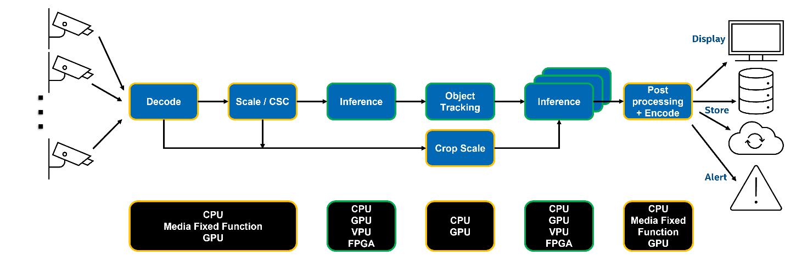
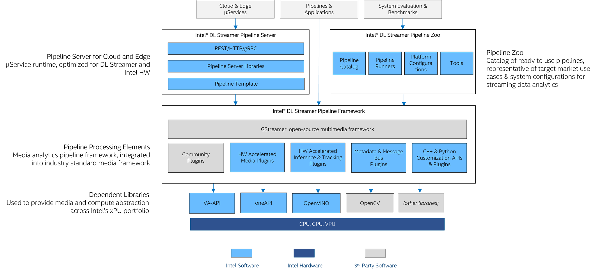

# Intel® Deep Learning Streamer

**Intel® Deep Learning Streamer (Intel® DL Streamer)** is an open-source
streaming media analytics framework. It is based on GStreamer\* multimedia
framework, and it is used for creating complex media analytics pipelines for the Cloud
or at the Edge. DL Streamer consists of:

- [Intel® DL Streamer Pipeline
  Framework](https://github.com/open-edge-platform/edge-ai-libraries/tree/release-1.2.0/libraries/dl-streamer)
  for designing, creating, building, and running media analytics
  pipelines. It includes C++ and Python APIs.
- [Intel® DL Streamer Pipeline
  Server](https://github.com/open-edge-platform/edge-ai-libraries/tree/release-1.2.0/microservices/dlstreamer-pipeline-server)
  for deploying and scaling media analytics pipelines as
  micro-services on one or many compute nodes. It includes REST APIs
  for pipelines management.

**Media analytics** is the analysis of audio & video streams to detect,
classify, track, identify and count objects, events and people. The
analyzed results can be used to take actions, coordinate events,
identify patterns and gain insights across multiple domains, including:

- retail store and events facilities analytics
- warehouse and parking management
- industrial inspections
- safety and regulatory compliance
- security monitoring.

**Media analytics pipelines** transform media streams into insights
through audio / video processing, inference, and analytical operations
performed across multiple IP blocks.

High-performance Media Analytics solutions are difficult to build,
deploy, and benchmark. They require:

- Deep expertise in multiple domains, including media
  processing and Deep Learning based AI inferencing frameworks and
  tools (e.g., FFmpeg\*, GStreamer\*, OpenCV\*, OpenVINO™ toolkit,
  PyTorch\*, TensorFlow\*, ONNX\*)
- System-level SW and HW expertise (e.g., fixed function HW,
  programmable media, host/accelerator buffer sharing, CPU Core &
  thread allocation, wide range of system configurations and their
  trade-offs)
- Expertise across different CPU classes, SKUs, and their generations,
  in addition to expertise in integrated & discrete HW accelerators
  and their interactions with CPUs and the rest of the host system (e.g.,
  CPUs, integrated GPUs, discrete GPUs and VPUs)

**Intel® DL Streamer** makes **Media Analytics** easy:

- Get better performance, using less code
- Quickly develop, optimize, benchmark, and deploy video & audio
  analytics pipelines in the Cloud and at the Edge
- Analyze video & audio streams, create actionable results, capture,
  and send results to the cloud
- Leverage the efficiency and computational power of Intel® hardware
  platforms
- Make your code easily portable across different Intel® hardware platforms,
  CPU & xPU classes and generations
- Leverage GStreamer\* open-source project community investments in
  new features & bug-fixes
- Leverage NNStreamer\* selected AI inferencing elements via pipeline
  inter-operability
- Customize and extend your solution by reviewing, analyzing, and
  modifying Intel® DL Streamer open-sourced code.

**Intel® DL Streamer** uses OpenVINO™ Runtime inference back-end,
optimized for Intel hardware platforms and supports over
[70 NN Intel and open-source community pre-trained models](https://github.com/open-edge-platform/edge-ai-libraries/blob/release-1.2.0/libraries/dl-streamer/docs/scripts/supported_models.json), and models converted
[from other training frameworks](https://docs.openvino.ai/2024/openvino-workflow/model-preparation/convert-model-to-ir.html).
These models include object detection, object classification, human pose
detection, sound classification, semantic segmentation, and other use
cases: SSD, MobileNet, YOLO, Tiny YOLO, EfficientDet, ResNet,
FasterRCNN, and other models.

**Intel® DL Streamer** provides over two dozen samples, demos and
reference apps for the most common media analytics use cases. They are
included in
[Intel® Deep Learning Streamer Pipeline Framework](https://github.com/open-edge-platform/edge-ai-libraries/tree/release-1.2.0/libraries/dl-streamer),
[Intel® DL Streamer Pipeline Server](https://github.com/open-edge-platform/edge-ai-libraries/tree/release-1.2.0/microservices/dlstreamer-pipeline-server),
[Open Visual Cloud](https://github.com/OpenVisualCloud), and
[Intel® Edge Software Hub](https://www.intel.com/content/www/us/en/edge-computing/edge-software-hub.html)
The samples demonstrate C++ and/or Python based: Action Recognition, Face Detection and
Recognition, Drawing Face Attributes, Audio Event Detection, Vehicle and
Pedestrian Tracking, Human Pose Estimation, Metadata Publishing, Smart
City Traffic and Stadium Management, Intelligent Ad insertion, single- &
multi- channel video analytics pipelines benchmark, and other use cases.

**Intel® DL Streamer** offers a long list of models and samples
optimized for Intel hardware platforms, which can be used as a
reference or a starting point for a wide range of applications and
system configurations. These models and samples are a quick & easy way
to reach high performance, then benchmark and optimize your application
on your system.

**Intel® DL Streamer** is already used by many partners and customers
leading solutions, including [Open Visual
Cloud](https://github.com/OpenVisualCloud) Media Analytics services,
[NTT Software Innovation
Center](https://www.global.ntt/innovation/innovating-today/),
[Videonetics Technology Pvt. Limited](https://www.videonetics.com/),
AIVID TECHVISION and others.

## Testimonials

|  | “Intel® DL Streamer (OpenVINO™) is an easy-to-use and extensible application framework, which provides a well-organized set of classes and methods. In particular, Intel® DL Streamer allows us to add user-defined post processing with gvapython elements. This feature will help us develop AI-based video analytics applications for NTT's businesses, addressing various customer demands responsively.” — Takeharu Eda, Senior Research Engineer, NTT Software Innovation Center  |
|---|---|
|   | "Intel® DL Streamer Pipeline Server has helped TIBCO Software to develop and optimize Project AIR solution with less effort and shorter TTM, and to deliver better user experience that includes no-code data pipelines. Project AIR was able to easier deploy and expose optimized video analytics pipelines as microservices accessible for consumption via REST APIs." — Miguel Torres, Director of the Americas - Office of the CTO at TIBCO Software  |

------------------------------------------------------------------------

> **\*** *Other names and brands may be claimed as the property of
> others.*

:::{toctree}
:maxdepth: 2
:hidden:

get_started/get_started_index
dev_guide/dev_guide_index
elements/elements
supported_models
api_ref/api_reference
architecture_2.0/architecture_2.0
release-notes
:::
