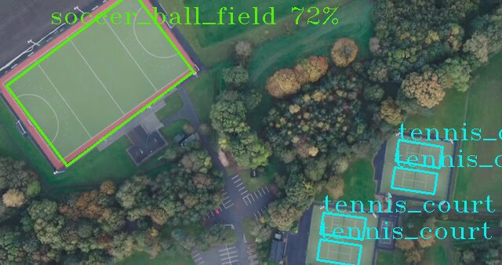
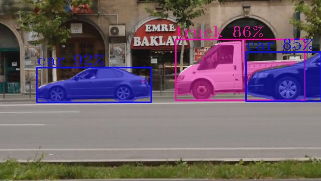

# Object Detection and Classification with Yolo models (gst-launch command line)

This set of samples demonstrates how to construct object detection pipelines via `gst-launch-1.0` command-line utility using latest YOLO models.

## How It Works
This set of samples utilizes GStreamer command-line tool `gst-launch-1.0` which can build and run GStreamer pipeline described in a string format.
The string contains a list of GStreamer elements separated by exclamation mark `!`, each element may have properties specified in the format `property`=`value`.

This sample builds GStreamer pipeline of the following elements
* `filesrc` or `urisourcebin` or `v4l2src` for input from file/URL/web-camera
* `decodebin3` for video decoding
* `videoconvert` for converting video frame into different color formats
* [gvadetect](https://dlstreamer.github.io/elements/gvadetect.html) uses for full-frame object detection and marking objects with labels
* [gvawatermark](https://dlstreamer.github.io/elements/gvawatermark.html) for points and theirs connections visualization
* `autovideosink` for rendering output video into screen
> **NOTE**: `sync=false` property in `autovideosink` element disables real-time synchronization so pipeline runs as fast as possible

## Models

The samples use YOLO models from different repositories as listed in a table below. The model preparation and conversion method depends on the model source.
The instructions assume Intel® DL Streamer framework is installed on the local system along with Intel® OpenVINO™ model downloader and converter tools,
as described here: [Tutorial](https://dlstreamer.github.io/get_started/tutorial.html#tutorial-setup).

For yolov5su, yolov8s (8n-obb,8n-seg), yolov9c, yolov10s and yolo11s (yolo11s-seg, yolo11s-obb) models it is also necessary to install the ultralytics python package:

```sh
pip install ultralytics
```
The samples demonstrate deployment and inference with GStreamer command line tool `gst-launch-1.0` and Intel® DL Streamer components for the following set of models:

| Model        | Model Preparation                                                                                         | Model pipeline (model-proc)       |
| ------------ | --------------------------------------------------------------------------------------------------------- | ----------------------------------|
| yolox-tiny   | omz_downloader and omz_converter                                                                          | gvadetect model-proc=yolo-x.json  |
| yolox_s      | Intel® OpenVINO™ model from [YOLOX repository](https://github.com/Megvii-BaseDetection/YOLOX)             | gvadetect model-proc=yolo-x.json  |
| yolov5s      | Pytorch -> OpenVINO™ converter from [YOLOv5 repository](https://github.com/ultralytics/yolov5)            | gvadetect model-proc=yolo-v7.json |
| yolov5su     | Ultralytics python exporter from [Ultralytics repository](https://github.com/ultralytics)                 | gvadetect model-proc=yolo-v8.json |
| yolov7       | Pytorch -> ONNX -> OpenVINO™ converter from [YOLOv7 repository](https://github.com/WongKinYiu/yolov7.git) | gvadetect model-proc=yolo-v7.json |
| yolov8s      | Ultralytics python exporter from [Ultralytics repository](https://github.com/ultralytics)                 | gvadetect \<model-proc not needed\> |
| yolov8n-obb  | Ultralytics python exporter from [Ultralytics repository](https://github.com/ultralytics)                 | gvadetect \<model-proc not needed\> |
| yolov8n-seg  | Ultralytics python exporter from [Ultralytics repository](https://github.com/ultralytics)                 | gvadetect \<model-proc not needed\> |
| yolov9c      | Ultralytics python exporter from [Ultralytics repository](https://github.com/ultralytics)                 | gvadetect \<model-proc not needed\> |
| yolov10s     | Ultralytics python exporter from [Ultralytics repository](https://github.com/ultralytics)                 | gvadetect \<model-proc not needed\> |
| yolo11s      | Ultralytics python exporter from [Ultralytics repository](https://github.com/ultralytics)                 | gvadetect \<model-proc not needed\> |
| yolo11s-seg  | Ultralytics python exporter from [Ultralytics repository](https://github.com/ultralytics)                 | gvadetect \<model-proc not needed\> |
| yolo11s-obb  | Ultralytics python exporter from [Ultralytics repository](https://github.com/ultralytics)                 | gvadetect \<model-proc not needed\> |

## Samples


The sample `yolo_detect.sh` script can be used to build and run an object detection pipeline.

```sh
./yolo_detect.sh <MODEL> <DEVICE> <INPUT> <OUTPUT_TYPE> <PRECISION>
```
> **NOTE**: Prior to running `yolo_detect.sh`, ensure that you execute the `download_public_models.sh` script found in the top-level `samples` directory. This will allow you to download the full suite of YOLO models or select an individual model from the options presented above.


Example run of `yolo11s` model with CPU device on sample video, saving results into local video file:

```sh
./yolo_detect.sh yolo11s CPU
```

Another example run of `yolov11s` model with GPU device on sample video, saving results into local video file:

```sh
./yolo_detect.sh yolov11s GPU
```

Yet antoher example run of `yolo11s` model with GPU device on your own mp4 video, showing results on a display:

```sh
./yolo_detect.sh yolov9c CPU path/to/your/video.mp4 display
```

Example run of `yolo11s-obb` model with FP32 precision with GPU device on online video with VAAPI acceleration, saving results to file:

```sh
./yolo_detect.sh yolo11s-obb GPU https://videos.pexels.com/video-files/3150382/3150382-sd_640_338_25fps.mp4 file va FP32
```

Sample output for `yolo11s-obb` model:



Example run of `yolo11s-seg` model with FP32 precision with GPU device on online video with VAAPI acceleration, saving results to file:

```sh
./yolo_detect.sh yolo11s-seg GPU https://videos.pexels.com/video-files/1192116/1192116-sd_640_360_30fps.mp4 file va FP32
```

Sample output for `yolo11s-seg` model:



Please examine `yolo_detect.sh` script to see how to source data from input camera and how to generate other types of the output.

## See also

* [Samples overview](../../README.md)
