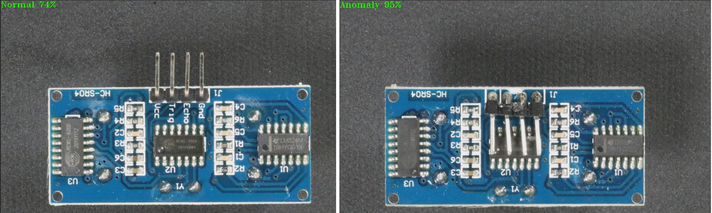

# Deployment of models trained with Intel® Geti™ Platform (gst-launch command line)

This set of samples demonstrates how to deploy models trained with [Intel® Geti™ Platform](https://geti.intel.com/).

## How It Works
The Intel® Geti™ Platform defines a set of media analytics pipelines corresponding to common usage scenarios: classification, detection, segmentation, etc.
In all cases, the platform outputs AI models in Intel® OpenVINO™ format: 'openvino.xml' and 'openvino.bin'.

This sample assumes a user has already trained models using Intel® Geti™ Platform and stored the output models in the followign folder structure:

```sh
-intel
 |-geti-anomaly-detection/          # model trained with Geti™ 'Anomaly detection PADIM/STFPM/UFlow' project
   |-padim/FP16                     # PADIM model
     |-openvino.xml                 # model metadata
     |-openvino.bin                 # model weights
   |-stfpm/FP16                     # STFPM model
     |-openvino.xml                 # model metadata
     |-openvino.bin                 # model weights
   |-uflow/FP32                     # UFlow model
     |-openvino.xml                 # model metadata
     |-openvino.bin                 # model weights
 |-geti-detection/FP16              # model trained with Geti™ 'Detection bounding box' project
   |-openvino.xml                   # model metadata
   |-openvino.bin                   # model weights
 |-geti-classification-single/FP16  # model trained with Geti™ 'Classification single label' project
   |-openvino.xml                   # model metadata
   |-openvino.bin                   # model weights
 |-geti-classification-multi/FP16   # model trained with Geti™ 'Classification multi label' project
   |-openvino.xml                   # model metadata
   |-openvino.bin                   # model weights
 |-geti-classification-multi/FP32   # model trained with Geti™ 'Classification multi label' project
   |-openvino.xml                   # model metadata
   |-openvino.bin                   # model weights
 |-geti-obb/FP16                    # model trained with Geti™ 'Oriented Bounding Box Detection' project
   |-openvino.xml                   # model metadata
   |-openvino.bin                   # model weights
 |-geti-segmentation/FP16           # model trained with Geti™ 'Instance Seggmentation' project
   |-openvino.xml                   # model metadata
   |-openvino.bin                   # model weights
```

The set of samples demonstrates how to deploy above models to run inference with GStreamer command line tool `gst-launch-1.0` and DL Streamer framework components.

## Samples

The 'geti_sample.sh' script sample builds GStreamer pipeline composed of the following elements:
* `filesrc` or `urisourcebin` or `v4l2src` for input from file/URL/web-camera
* `decodebin3` for video decoding
* [gvadetect](../../../../docs/source/elements/gvadetect.md) uses for full-frame object detection and marking objects with labels
* [gvaclassify](../../../../docs/source/elements/gvaclassify.md) uses for full-frame object classficiation
* [gvawatermark](../../../../docs/source/elements/gvawatermark.md) for points and theirs connections visualization
* `autovideosink` for rendering output video into screen
* `vah264enc` or `vah264lpenc` and `filesink` for encoding video stream and storing in a local file
> **NOTE**: `sync=false` property in `autovideosink` element disables real-time synchronization so pipeline runs as fast as possible

Before running **geti_deployment** samples

```sh
    export MODELS_PATH="$HOME"/models
    cd /opt/intel/dlstreamer/samples/gstreamer/gst_launch/geti_deployment/
```

Example deployment of Geti™ anomaly detection UFlow model using CPU device, saving results into a file on local disk.
> **NOTE**: User must provide a relevant input video file.

```sh
./geti_sample.sh anomaly-detection uflow/FP32/model.xml CPU opencv INPUT_VIDEO_FILE json
```




Example deployment of Geti™ bounding-box detection model using GPU device, saving results into a file on local disk.
```sh
./geti_sample.sh detection GPU
```

Example deployment of Geti™ single-label classification model using NPU device, saving results into a file on local disk.
```sh
./geti_sample.sh classification_single NPU
```

Example deployment of Geti™ multi-label classification model using CPU device, saving results into a file on local disk.
```sh
./geti_sample.sh classification_multi CPU
```

## See also
* [Samples overview](../../README.md)
