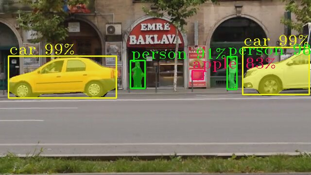

# Instance Segmentation Sample (gst-launch command line)

This sample demonstrates an instance segmentation pipeline built using the `gst-launch-1.0` command-line utility.



## How It Works
The sample utilizes the GStreamer command-line tool `gst-launch-1.0`, which can construct and execute a GStreamer pipeline defined in a string format. This string comprises a sequence of GStreamer and DLStreamer elements, each separated by an exclamation mark (`!`). Properties for each element can be specified using the format `property`=`value`.


The sample constructs GStreamer pipelines with the following elements:
* `filesrc` or `urisourcebin` or `v4l2src` for input from a file, URL, or web camera
* `decodebin3` to construct a decoding pipeline using available decoders and demuxers via auto-plugging
* `vapostproc ! video/x-raw(memory:VAMemory)` to facilitate video processing on the GPU
* [gvadetect](../../../../docs/source/elements/gvadetect.md) for performing object detection using Mask RCNN models
* [gvawatermark](../../../../docs/source/elements/gvawatermark.md) to visualize segmentation masks on the video
* [gvafpscounter](../../../../docs/source/elements/gvafpscounter.md) to measure and display frames per second
* [gvametaconvert](../../../../docs/source/elements/gvametaconvert.md) o transform the metadata into JSON format
* [gvametapublish](../../../../docs/source/elements/gvametapublish.md) to save the metadata as a JSON file
* `vah264enc ! h264parse ! mp4mux` or `vah264lpenc ! h264parse ! mp4mux` to encode the raw video into H.264 bitstream, ensure that the stream is correctly formatted and contains the necessary headers and metadata, and to create the MP4 file structure
* `jpegenc` for encoding frames as JPEG images
* `autovideosink` for displaying the output video on the screen
* `filesink` and `multifilesink` for writing data to a file or multiple files
> **NOTE**: The `sync=false` property in sink elements is used to disable real-time synchronization, allowing the pipeline to run at maximum speed.

The pipeline created by the example script is displayed for inspection before the pipeline starts.

## Models

The sample uses the following pre-trained models from OpenVINO™ Toolkit [Open Model Zoo](https://github.com/openvinotoolkit/open_model_zoo)
*   [__mask_rcnn_inception_resnet_v2_atrous_coco__](https://github.com/openvinotoolkit/open_model_zoo/tree/master/models/public/mask_rcnn_inception_resnet_v2_atrous_coco) (default)
*   [__mask_rcnn_resnet50_atrous_coco__](https://github.com/openvinotoolkit/open_model_zoo/tree/master/models/public/mask_rcnn_resnet50_atrous_coco)


> **NOTE**: Before running samples (including this one), run the script `download_omz_models.sh` once (the script is located in `samples` top folder) to download all models required for this and other samples.


## Running

If Python requirements are not installed yet:

```sh
python3 -m pip install --upgrade pip
python3 -m pip install -r ../../../../requirements.txt
cd -
```
The sample script __instance_segmentation.sh__ accepts the following command line optional arguments:
* --input - a web camera device (ex. `/dev/video0`), an url or a path to an MP4 video file (*a sample video from videos.pexels.com is used by default*)
* --model - mask_rcnn_inception_resnet_v2_atrous_coco (*default*) or  mask_rcnn_resnet50_atrous_coco
* --output - file (*default*), display, fps, json, display-and-json, jpeg
* --device - CPU (*default*), GPU, NPU

The --output option is described below in __Sample Output__ section.

For example:

```sh
./instance_segmentation.sh --input my_video.mp4 --output json --device GPU
```

will run the default model (mask_rcnn_inception_resnet_v2_atrous_coco) on a GPU to detect object boundaries in my_video.mp4. The detection results will be stored in a file named DLS_my_video_GPU.json.


## Sample Output

The sample script will save the detection results in a file within the current directory. The file naming convention is as follows:  DLS_{*file*}_{*device*}.{*extension*}. Here, *file* is the name of the original input file without its extension, *device* denotes the computing device utilized for inference (which can be specified using the --device option), and *extension* is "mp4", "jpeg" or "json", depending on the requested output type.


The script's output is determined by the --output parameter value:

* file - segmentation results are overlaid on the video frames and saved as an MP4 video file
* jpeg - similar to *file*, but the frames are saved as individual JPEG images
* display - the results are displayed on the screen in real-time
* json - the model's output is stored in a JSON file
* display-and-json - the results are both displayed on the screen and saved in a JSON file
* fps - the script measures and displays the frames per second without saving any visual output

## See also
* [Samples overview](../../README.md)