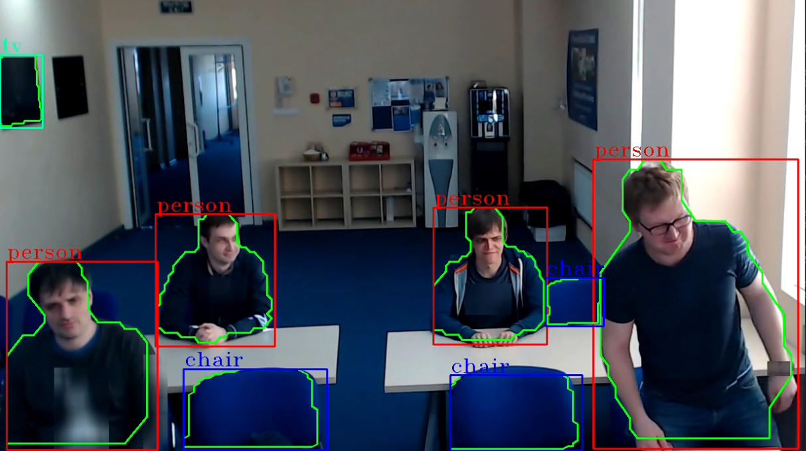

# Instance Segmentation Sample (gst-launch command line)

This sample demonstrates demonstrates instance segmentation pipeline constructed via `gst-launch-1.0` command-line utility.



## How It Works
The sample utilizes GStreamer command-line tool `gst-launch-1.0` which can build and run GStreamer pipeline described in a string format.
The string contains a list of GStreamer elements separated by exclamation mark `!`, each element may have properties specified in the format `property`=`value`.

This sample builds GStreamer pipeline of the following elements
* `filesrc` or `urisourcebin` or `v4l2src` for input from file/URL/web-camera
* `decodebin` for video decoding
* `videoconvert` for converting video frame into different color formats
* [object_detect] for converting video frame into custom tensor, inferencing using OpenVINO™ toolkit and post process data to bounding box and mask.
* [object_classify] for setting preprocess to crop bounding box, remove background, run inferencing using OpenVINO™ toolkit and post process data to attach classification results.
* [roi_split] cropping all ROI regions to images and push.
* [opencv_remove_background] Removes background for each ROI image.
* [gvawatermark](https://dlstreamer.github.io/elements/gvawatermark.html) for points and theirs connections visualization
* `autovideosink` for rendering output video into screen
> **NOTE**: `sync=false` property in `autovideosink` element disables real-time synchronization so pipeline runs as fast as possible


## Models

The sample uses by default the following pre-trained model from OpenVINO™ Toolkit [Open Model Zoo](https://github.com/openvinotoolkit/open_model_zoo)
*   __instance-segmentation-security-1040__ is primary detection to detect boxes and masks

The sample can also run using below models with no modifications.
*   __instance-segmentation-security-0002__
*   __instance-segmentation-security-0091__
*   __instance-segmentation-security-1039__
*   __instance-segmentation-security-0228__

> **NOTE**: Before running samples (including this one), run script `download_omz_models.sh` once (the script located in `samples` top folder) to download all models required for this and other samples.

## Running

If Python requirements are not installed yet:

```sh
python3 -m pip install --upgrade pip
python3 -m pip install -r ../../../../requirements.txt
cd -
```
Run sample:
#### Segmentation
```sh
./instance_segmentation.sh [INPUT_VIDEO] [DEVICE] [SINK_ELEMENT] [SEGMENTATION_MODEL]
```
#### Classification with background removal
```sh
./classification_with_background_removal.sh [INPUT_VIDEO] [DEVICE] [SINK_ELEMENT] [SEGMENTATION_MODEL]
```

#### ROI background removal
```sh
./roi_background_removal.sh [INPUT_VIDEO] [DEVICE] [SINK_ELEMENT] [SEGMENTATION_MODEL]
```

The sample takes three command-line *optional* parameters:
1. [INPUT_VIDEO] to specify input video file.
The input could be
* local video file
* web camera device (ex. `/dev/video0`)
* RTSP camera (URL starting with `rtsp://`) or other streaming source (ex URL starting with `http://`)
If parameter is not specified, the sample by default streams video example from HTTPS link (utilizing `urisourcebin` element) so requires internet conection.
2. [DEVICE] to specify device for detection and classification.
        Please refer to OpenVINO™ toolkit documentation for supported devices.
        https://docs.openvinotoolkit.org/latest/openvino_docs_IE_DG_supported_plugins_Supported_Devices.html
        You can find what devices are supported on your system by running following OpenVINO™ toolkit sample:
        https://docs.openvinotoolkit.org/latest/openvino_inference_engine_ie_bridges_python_sample_hello_query_device_README.html
3. [SINK_ELEMENT] to choose between render mode and fps throughput mode:
    * display - render (default)
    * fps - FPS only
4. [SEGMENTATION_MODEL] to set different supported models.:
    * instance-segmentation-security-1040 (default)

## Sample Output

The sample
* prints gst-launch-1.0 full command line into console
* starts the command and either visualizes video with bounding boxes and contour points around detected objects or
prints out fps if you set SINK_ELEMENT = fps

## See also
* [Samples overview](../../README.md)