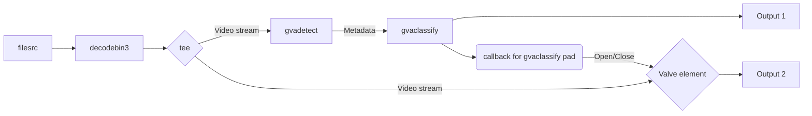
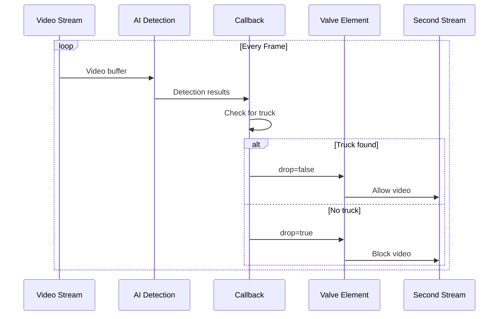

# Valve Open/Close Detection Sample for DLStreamer


### Overview
This sample demonstrates how to build an application that constructs and executes a DLStreamer pipeline with two outputs, where one output is controlled by GStreamer's __valve__ element using a callback method. The application creates two parallel video streams with __intelligent valve control__ based on real-time truck detection using AI models.
### Key Features
- Dual Video Streams: Two synchronized output windows with valve-controlled flow
- AI Truck Detection: YOLO11s model for real-time object detection
- Smart Valve Control: Second stream activates only when trucks are detected
- Object Tracking: Maintains object identity across frames
- Vehicle Classification: Detailed vehicle attribute analysis
-  __Callback-Based__ Control: Demonstrates probe callback implementation



The individual pipeline stages implement the following functions: 
* __filesrc__ element reads video stream from a local file
* __decodebin3__ element decodes video stream into individual frames 
* __gvadetect__ element runs AI inference object detection for each frame
* __gvaclassify__ element runs AI inference object classification for each frame
* __gvawatermark__ element draws (overlays) object bounding boxes on top of analyzed frames
* __autovideosink__ element renders video stream on local display 

In addition, the sample uses 'queue' and 'videoconvert' elements to adapt interface between functional stages.

## How It Works

###  Pipeline creations steps
#### Initiaization

###### <u> Initialize GStreamer framework </u>

```
Gst.init(None)  # Initialize GStreamer
```
- Initialize GStreamer framework

###### <u>Controller creation</u>

```
controller = DualStreamController(video_source)
```

- Create controller instance with video file path
- Initialize pipeline components (valve, classifier elements)
</br>

#### Pipeline construction

###### <u>Video Source & Preprocessing</u>

```
filesrc location=video.mp4 ! decodebin3 !
videoconvert ! videoscale ! videorate ! video/x-raw,width=640,height=480,framerate=30/1,format=I420
```
- Input: MP4 video file
- Processing: Decode, convert, scale to 640x480, set 30 FPS
- Output: I420 format for AI processing


###### <u>Stream Splitting</u>
```
tee name=main_tee allow-not-linked=false
```
- Creates identical copies of video stream
</br>

#### Preview Stream (Always Active)

```
queue name=preview_queue max-size-buffers=30 !
identity name=sync_point1 sync=true !
```
- Buffer: 30 frames capacity
- Sync: Maintains timing consistency

###### <u>Text Overlay</u>
```
textoverlay name=ai_overlay text="Detection Video Stream"
    valignment=bottom halignment=center
    font-desc="Sans Bold 14" color=0xFF000000
```
- Add stream identification label


###### <u>AI Detection Chain</u>
```
gvadetect model=yolo11s.xml threshold=0.6 inference-interval=10 !
gvatrack name=object_tracker !
gvaclassify model=vehicle-attributes-recognition.xml inference-interval=1 !
```

- Detection: YOLO11s model, 60% confidence threshold, every 10th frame
- Tracking: Maintain object identity across frames
- Classification: Vehicle attributes, every frame for detected objects

###### <u>Visualization & Output</u>


```
gvawatermark name=preview_watermark !
videoconvert ! autovideosink sync=true
```
- Watermark: Renders detection results as overlays
- Output: First video window (always visible)
</br>

#### Valve Stream (Controlled)


###### <u>Valve Control Element</u>

```
valve name=control_valve drop=false !
```
-  Control video flow based on detection results
- States:
    - ```drop=false```  Video flows through
    - ```drop=true``` Video blocked

You can learn more about the valve element and its properties in the [GStreamer documentation](https://gstreamer.freedesktop.org/documentation/coreelements/valve.html?gi-language=python).
</br>

#### Processing Chain
```
textoverlay text="Valve Stream" !
gvadetect model=yolo11s.xml inference-interval=1 !
gvawatermark ! videoconvert ! autovideosink sync=true
```
- Secondary stream with independent AI processing:
    - Detection: Every frame for responsive control
    - Output: Second video window (conditional visibility)
</br>

#### Callback Setup
###### <u>Element Reference Retrieval</u>

```
self.pre_view_classify = self.pipeline.get_by_name("pre_view_classify")
pre_view_classify_pad = self.pre_view_classify.get_static_pad("sink")
```

- Get reference to classification element's input pad


###### <u>Probe Attachment</u>
```
pre_view_classify_pad.add_probe(
    Gst.PadProbeType.BUFFER, 
    self.object_detector_callback, 
    0
)
```
-  Attach callback function to monitor detection results:
    - Trigger: Every buffer passing through classifier
    - Function: **object_detector_callback** processes AI results
</br>

#### Detection Callback Logic
###### <u>Metadata Extraction</u>
```
rmeta = GstAnalytics.buffer_get_analytics_relation_meta(buffer)
for mtd in rmeta:
    if type(mtd) == GstAnalytics.ODMtd:
        object_type = GLib.quark_to_string(mtd.get_obj_type())
```
- Extract AI detection results from video buffer:
    - Analytics Meta: Contains detection information
    - Object Type: Identified object class (truck, car, etc.)


###### <u>Valve Control Decision</u>
```
if object_type == "truck":
    self.open_valve()    # Set drop=false
else:
    self.close_valve()   # Set drop=true
```
- Control valve based on detection results:
    - __Truck Detected__: Enable second stream
    - __No Truck__: Disable second stream
</br>

#### Pipeline Execution
###### <u>State Management</u>
```
controller.pipeline.set_state(Gst.State.PLAYING)
```
- Start video processing:
    - Transitions pipeline from NULL to PLAYING state
    - Begins video flow and AI processing

###### <u>Message loop</u>
```
while not terminate:
    msg = bus.timed_pop_filtered(
        Gst.CLOCK_TIME_NONE, 
        Gst.MessageType.EOS | Gst.MessageType.ERROR
    )
```
- Monitor pipeline status and handle events"
    - EOS: End of stream (video finished)
    - ERROR: Pipeline errors
    - Interrupt: Ctrl+C handling
</br>

#### Runtime Behavior
###### <u>Continuous Operation</u>


- Output Streams:
    - Stream 1: Always displays video with AI annotations
    - Stream 2: Shows video only when trucks are detected
    - Console: Real-time detection events and system status
</br>

## Prerequisite
This sample application requires video, models and proc-model files. Those files can be downloaded in the following way:
</br>

#### Video sample
Sample video file are available in the following repo: [edge-ai-resources](https://github.com/open-edge-platform/edge-ai-resources). But that particular one used in this sample can be downloaded by following command(s):
```
mkdir videos
wget -P ./videos https://github.com/open-edge-platform/edge-ai-resources/raw/main/videos/cars_extended.mp4
```
</br>

#### Model file

All models OpenVINO can be downloaded by [Open Model Zoo](../../../download_omz_models.sh) download script. But the one used in this sample can be downloaded by following commands:

```
mkdir models
wget -P ./models https://storage.openvinotoolkit.org/repositories/open_model_zoo/2023.0/models_bin/1/vehicle-attributes-recognition-barrier-0039/FP16/vehicle-attributes-recognition-barrier-0039.xml
wget -P ./models https://storage.openvinotoolkit.org/repositories/open_model_zoo/2023.0/models_bin/1/vehicle-attributes-recognition-barrier-0039/FP16/vehicle-attributes-recognition-barrier-0039.bin
```

#### post-proc file
If your current working directory is the open-close-valve-sample folder, the model-proc file should be available at the following location:
```
ls ../../model_proc/intel/vehicle-attributes-recognition-barrier-0039.json
```
Otherwise, the user must adjust the file path appropriately.

## Sample execution

#### Command line

```
<open-close-valve-sample folder>: python3 open_close_valve_sample.py
```
## Sample Output

The sample:
* Opens two (windows) sinks
* One window continuously displays the video file.
* The second window becomes active only when a truck is detected in the first window. The valve element is operated (opened/closed) depending on whether a truck is detected.
* While both windows are active, they display the same synchronized content.


## See also
* [Samples overview](../../README.md)